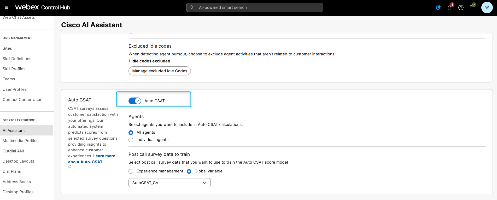
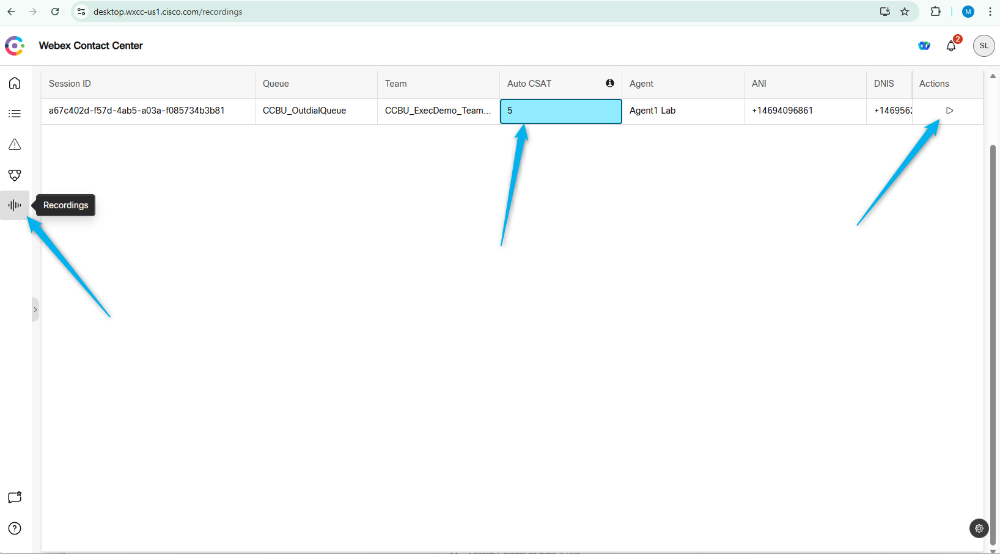

## Feature Description

The survey feature in Webex Contact Center is a valuable tool for gathering customer feedback. However, experience shows that only a small percentage of customers take the time to complete surveys. Typically, surveys are filled out by customers who are either extremely satisfied or dissatisfied, which may not represent the full spectrum of customer experiences.

The Auto CSAT model is a Cisco native AI model leveraging deep learning techniques to predict the CSAT score for **every customer interaction**.

The predicted CSAT scores are tailored to each customer, reflecting their unique experiences with customer service.

Survey data and interaction data are utilized to predict and assign a CSAT score to each interaction.

The Auto CSAT scores generated for every interaction are stored in the contact records, which can be retrieved by authorized partners and customers for delivering insights and maximize customer satisfaction and agent performance.

## Mission Details

Your mission is to learn how to view the AutoCSAT score for customer interactions using the Analyzer report and the Supervisor Dashboard.

## Build

### Task 1 [READ ONLY]. Order Provisioning & Control Hub Settings

1. You should purchase the new AI Assistant SKU **A-FLEX-AI-ASST** from CCW.

2. Once you purchase the offer, admins with the appropriate profile and access controls will be able to view the **AI Assistant** menu in Control Hub.

- You can enable or disable the **AutoCSAT** feature directly from the Control Hub.
- AutoCSAT can be enabled for **all agents** or for **selected individual agents**.

> **Note:**  
To activate post-call survey functionality, historical customer data is required to train the AutoCSAT model. There are two ways to collect this data:
1. Capture surveys using **Webex Contact Center Experience Management**.
2. Capture customer survey responses using the **Global variable** within your flow.

- Make a note in AutoCSAT setting in Controlhub we using **Global Variable** 

   

### Task 2 Explore AutoCSAT using Analyzer report and Supervisor Dashboard

1. Under Contact Center in Control Hub, click **Overview** and from **Quick Links** open up **Analyser**.
     

2. Go to Visualizations and search for the report with name **Auto CSAT**. It should have the ID -1282. Open the report. 
    

3. In the report you can see AutoCSAT that were generated for the calls, based on the Queue. You can see AutoCSAT information related to specific calls by drill-down into the AutoCSAT fields. 
    

4. [READ ONLY] When you log in to the Supervisor Dashboard, you can view the AutoCSAT score for specific calls and listen to the call recordings directly from the supervisor desktop. (The Supervisor user account is not configured for this lab. Please refer to the screenshot below to understand the experience of viewing the AutoCSAT from the Supervisor desktop.)
    

<strong>Congratulations, you have officially completed this mission! 🎉🎉 </strong>
