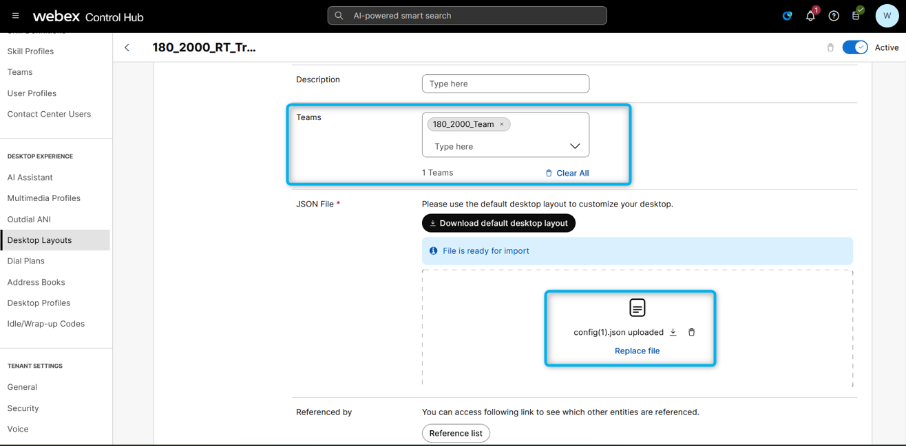
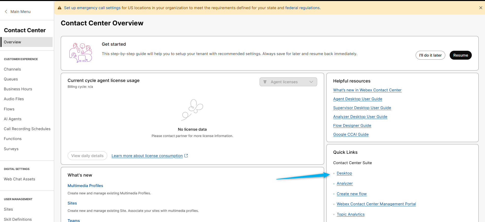
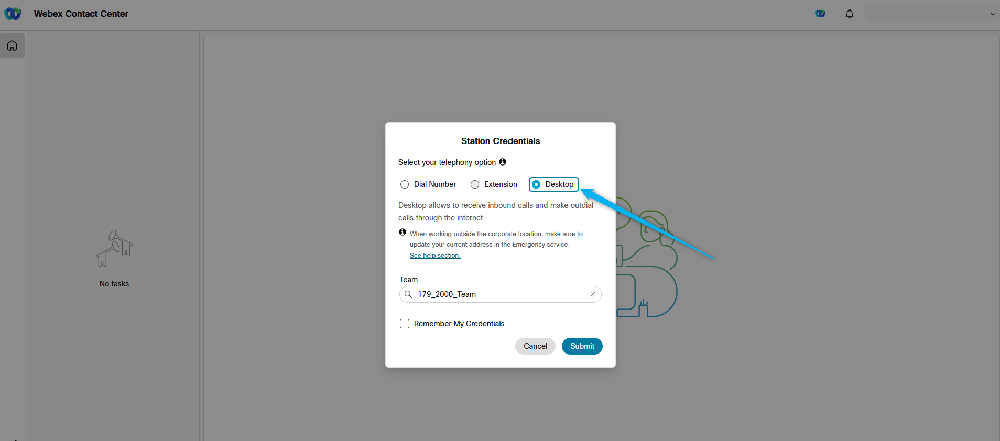
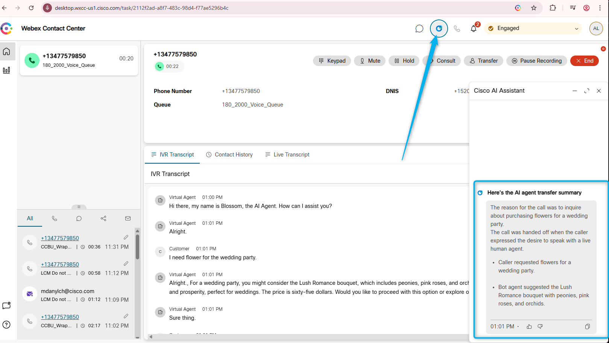

## Feature Description

AI Agent Transfer Summary enhances agent efficiency and elevate customer experiences.

When a customer calls the contact center and interacts with an AI Agent, they may request to speak with a live human agent at some point during the conversation. Once connected to an agent, it is important for the agent to receive a concise summary of the customer's interaction with the AI Agent. This summary provides the agent with a quick overview of the customer's call reason. The "AI Agent Handoff Summary" feature provides this summary, displaying it on the agent's desktop within the AI-Assistant Widget.

## Mission Details

Your mission is to:

1. Configure a smooth handoff to live human agent from AI Agent.
2. Modify Virtual Agent transcript
3. Use AI Assistant

## Build

### Task 1 [READ ONLY]. Order Provisioning & Control Hub Settings

1. You should purchase the new AI Assistant SKU **A-FLEX-AI-ASST** from CCW.

2. Once you purchase the offer, admins with the appropriate profile and access controls will be able to see the AI Assistant menu in Control Hub. After purchasing the offer, the customer can enable/disable the **Virtual Agent Transfer Summary** features from the Control Hub.
   

3. The Agent needs to be logged in to the Team that is configured with Desktop Layout that has "ai-assistant" features configured. 
    Note: Default desktop layout already incude the AI Agent Assistance widget 
     Agents Team:
       
     Desktop Layout:
    
     Desktop Layout file:  
     Make sure **ai-assistant** is configured under the **advancedHeader**.
   
     You can download preconfigured desktop layout here.
   [Desktop Layout](https://drive.google.com/file/d/1EnM-2r9XOVm2EcE6ND4fL3L62qZesm5_/view?usp=sharing){:target="_blank"} 

### Task 2. Test Agent Transfer Summary Feature

1. Login to the **Agent Desktop**. 
   

2. Select telephony option as **Desktop**.
   

3. Make sure you can see Agent Assistant widget.
   

4. Confirm that your Channel **Your_Attendee_ID_2000_Channel** is still configured with the flow **AutonomousAI_Flow_2000_Your_Attendee_ID** that includes the Autonomous AI agent, and the **Escalated** output is connected to the Queue node. This configuration is expected to remain the same as in the Autonomous AI Agent lab.
   

5. Place a test call and, for example, mention that you need some flowers for a wedding party. **Allow the AI Agent to complete its response before requesting to transfer the call to a live human agent**. 

6. Become Available on the Agent Desktop and answer the call. You will see a window with the message **AI agent transfer summary is ready** pops up. You can click on View Summary from the window.
   

7. The **AI agent transfer summary is ready** notification will disappear after a few seconds. However, you can always reopen it by clicking on the AI Assistant widget.
   

<strong>Congratulations, you have officially completed this mission! 🎉🎉 </strong>
