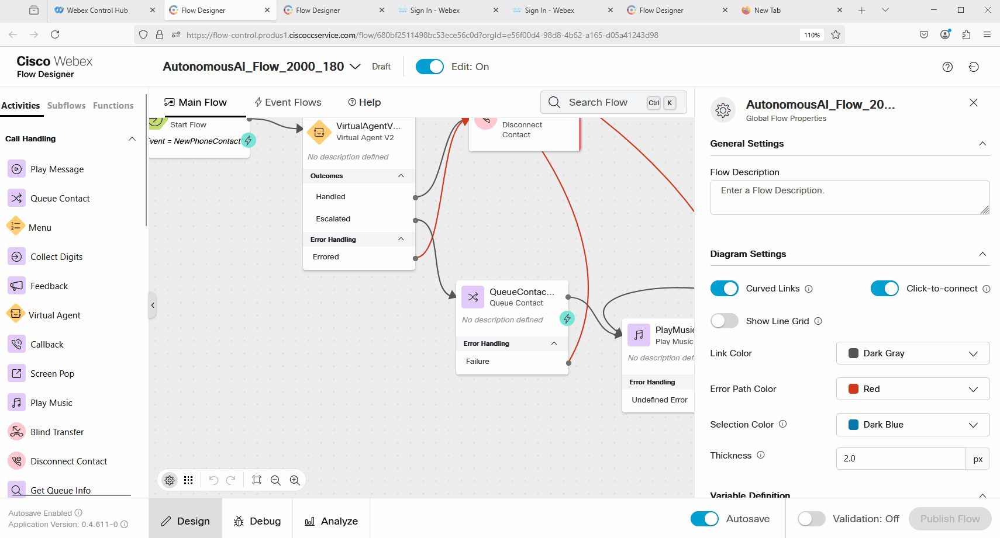
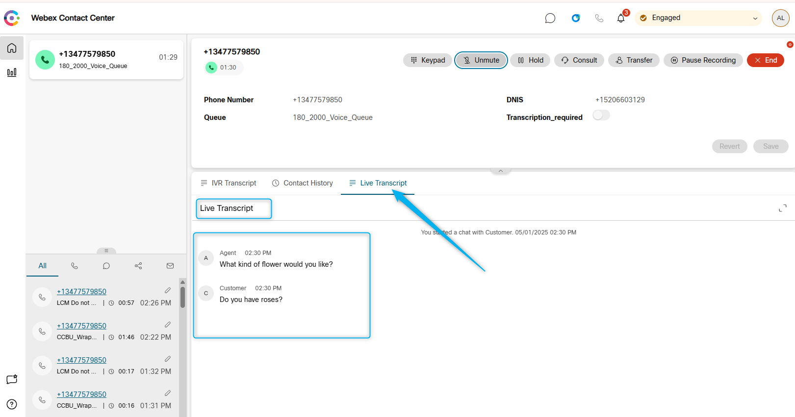

## Feature Description

You can enhance communication efficiency and quality assurance in your contact center with the real-time transcripts feature. It allows agents to access real-time transcriptions of customer interactions directly on their Agent Desktop, enabling them to follow conversations more accurately and respond effectively.

Benefits:

**Accurate communication**: Captures conversations precisely, aiding understanding, especially with diverse accents or non-native speakers.  
**Improved efficiency**: Eliminates manual note-taking, enabling agents to focus and resolve issues faster. 
**Better performance**: Helps agents deliver timely, accurate solutions, boosting customer trust. 
**Higher customer satisfaction**: Reduces misunderstandings, improving CSAT scores and experiences. 
**Training and quality assurance**: Provides reliable references for coaching, evaluations, and compliance checks. 
**Seamless integration**: Easily integrates with systems, optimizing queue-level management. 
**AI support**: Enhances decision-making with complementary AI Assistant features. 

## Mission Details

Your mission is to:

1. Enable Real-Time Transcript feature
2. Configure flow with **Start Media Stream** block
3. Test Real-Time Transcript feature

## Build

### Task 1 [READ ONLY]. Order Provisioning & Control Hub Settings

1. You should purchase the new AI Assistant SKU **A-FLEX-AI-ASST** from CCW.

2. Once you purchase the offer, admins with the appropriate profile and access controls will be able to see the AI Assistant menu in Control Hub. Post purchasing the offer, the customer can enable/disable the **Real-time Transcriptions** from the Control Hub.
   

3. The Agent needs to logged in to the Team that is configured with Desktop Layout that has Agent Assistance features configured. 
     Agents Team:
       
     Desktop Layout:
    
     Desktop Layout file: Make sure **RT_TRANSCRIPT** widget is configured. 
    
    You can download preconfigured desktop layout here.
   [Desktop Layout](https://drive.google.com/file/d/1EnM-2r9XOVm2EcE6ND4fL3L62qZesm5_/view?usp=sharing){:target="_blank"} 

### Task 2. Configure Flow for real-time transcripts

1. Open up your voice flow **AutonomousAI_Flow_2000_Your_Attendee_ID** and click on **Edit**.
    

2. Click on the **Event Flow**.
    

3. Drag and drop **Start Media Stream** node and connect **AgentAnswer** node to the **Start Media Stream** node. 
4. Drag and drop **End Flow** node and connect **Start Media Stream** to **End Flow**.
5. Validate and Publish the flow. 
    

### Task 3. Test Real-Time Transcript feature

1. Login to the Agent Desktop.
   

2. Confirm that your Channel **Your_Attendee_ID_2000_Channel** is still configured with the flow **AutonomousAI_Flow_2000_Your_Attendee_ID** that includes the Autonomous AI agent, and the **Escalated** output is connected to the Queue node. This configuration is expected to remain the same as in the Autonomous AI Agent lab.
   

3. Place a test call and ask to talk to an agent. 

4. Become Available on the Agent Desktop and answer the call. You will see the Live Transcripts window with the latest live transcripts between the caller and the human agent.
   

<strong>Congratulations, you have officially completed this mission! 🎉🎉 </strong>
