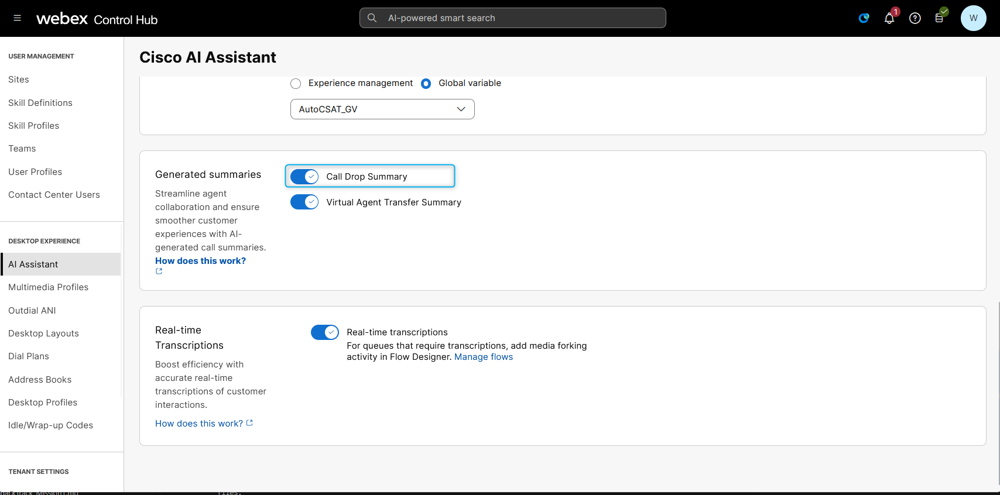
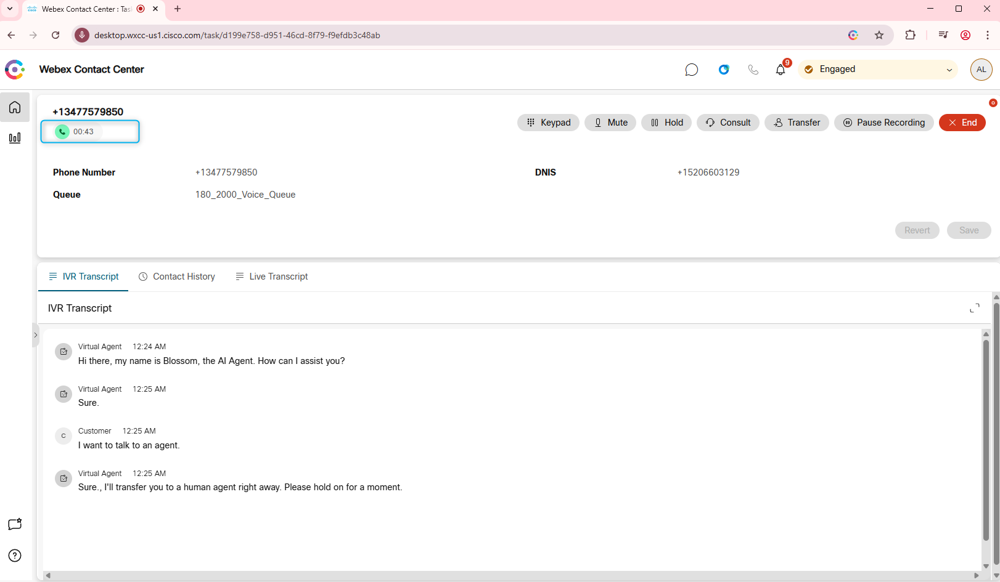

## Feature Description

Customers find it frustrating to repeat themselves, especially after a call drop. Now, agents can pick up where the call left off, reducing frustration and handling time, while empowering agents to work more efficiently.

The Cisco AI Assistant provides a summary of the recently dropped interaction, detailing the reason for the call and the last action discussed. This enables agents to seamlessly resume the conversation.

## Mission Details

Your mission is to:

Understand the provisioning process and Control Hub settings required to activate this AI feature. Review the agent configurations with the correct desktop layout. Test the feature.

## Build

### Task 1 [READ ONLY]. Order Provisioning & Control Hub Settings

1. You should purchase the new AI Assistant SKU **A-FLEX-AI-ASST** from CCW.

2. Once you purchase the offer, admins with the appropriate profile and access controls will be able to see the AI Assistant menu in Control Hub. Post purchasing the offer, the customer can enable/disable the **Call Drop Summary** features from the Control Hub.
   

3. The Agent needs to logged in to the Team that is configured with Desktop Layout that has Agent Assistance features configured.  
     Agents Team:
       
     Desktop Layout:
    
     Desktop Layout file: Make sure **ai-assistant** is configured under the **advancedHeader**
   
     You can download preconfigured desktop layout here.
   [Desktop Layout](https://drive.google.com/file/d/1EnM-2r9XOVm2EcE6ND4fL3L62qZesm5_/view?usp=sharing){:target="_blank"}

### Task 2. Test Call Drop Summary Feature

1. Login to the Agent Desktop.
   

2. Confirm that your Channel **Your_Attendee_ID_2000_Channel** is still configured with the flow **AutonomousAI_Flow_2000_Your_Attendee_ID** that includes the Autonomous AI agent, and the **Escalated** output is connected to the Queue node. This configuration is expected to remain the same as in the Autonomous AI Agent lab.
   

3. Place a test call and ask to talk to an agent. 

4. Become Available on the Agent Desktop and answer the call. 
* Stay on the call for 35 - 45 seconds 
* Have some conversation and then disconnect from the caller side. 
   

5. Call back from the same number. Ask to talk to an agent. 

6. Become Available on the Agent Desktop and answer the call. You will see AI Assistant Widget will have Call Drop Summary and the Agent Transfer Summary.
   

<strong>Congratulations, you have officially completed this mission! 🎉🎉 </strong>
