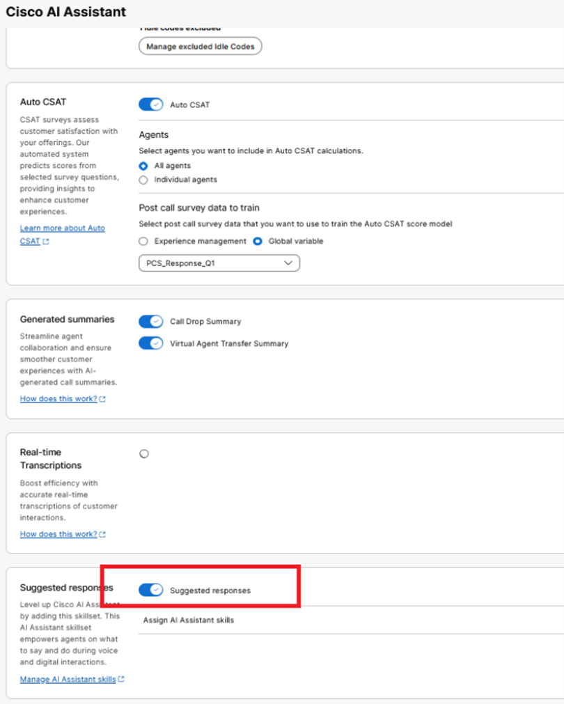
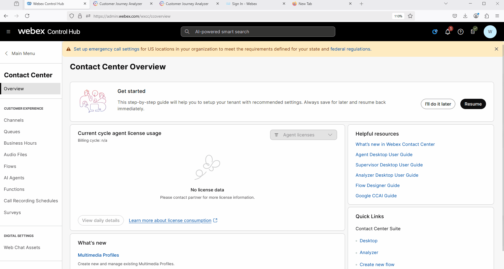
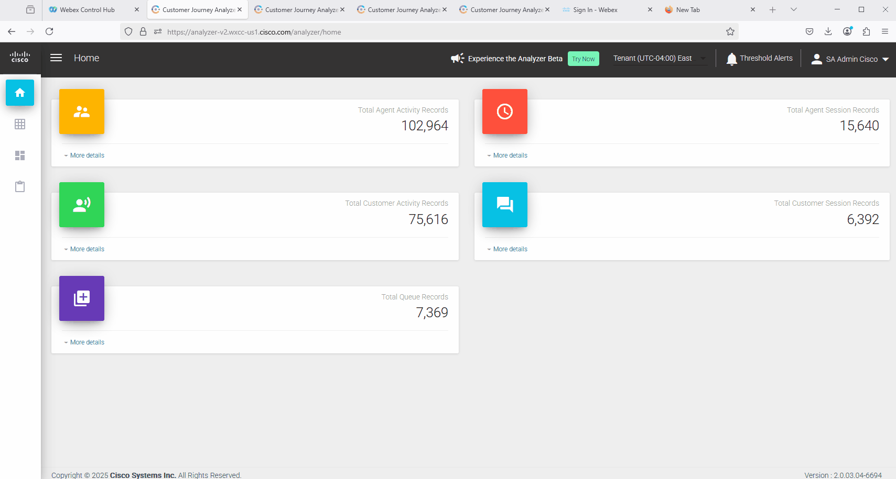
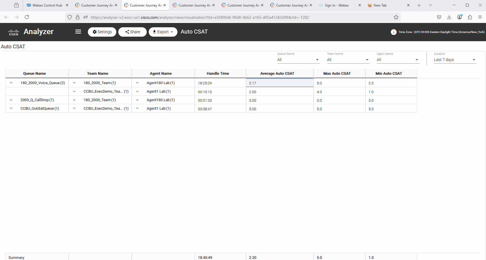
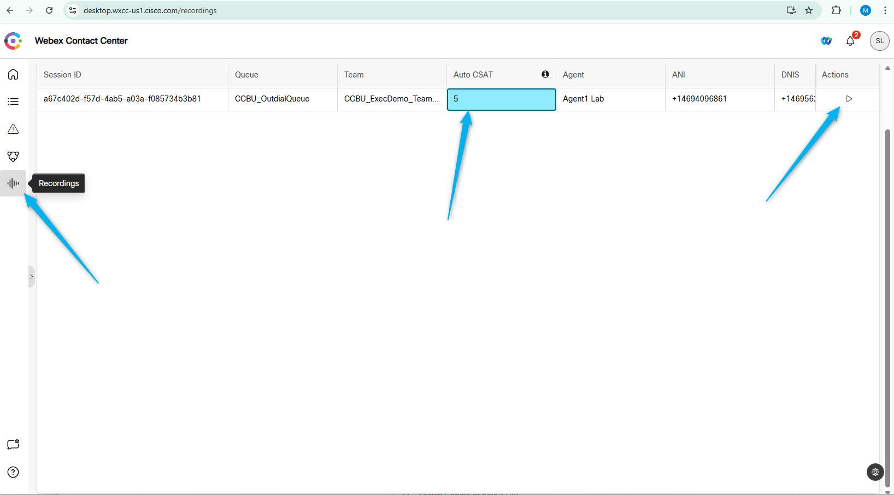

## Feature Description

Suggested responses in Webex Contact Center are real-time, AI-powered prompts that help agents with what to say and do during customer interactions, improving efficiency and consistency. Administrators can enable and customize this feature in Control Hub and AI Studio, linking specific knowledge and workflows to queues to tailor suggestions for different customer needs. Agents see these suggestions on their desktop during calls or chats, which helps them provide faster, more consistent, and higher-quality service.

## Mission Details

1.	Enable Suggested responses feature
2.	Create AI assistant skills and assign to queue’s.
3.	Create a knowledge base
4.	Configure flow with Start Media Stream block
5.	Test suggested responses feature - test1

## Build

### Task 1 [READ ONLY]. Order Provisioning & Control Hub Settings

1. You should purchase the new AI Assistant SKU **A-FLEX-AI-ASST** from CCW.

2. Once you purchase the offer, admins with the appropriate profile and access controls will be able to view the **AI Assistant** menu in Control Hub.

- You can enable or disable the **Suggested Responses** feature directly from the Control Hub.
- Suggested Responses can be enabled for **specific queues** or for **teams** or for **specific agents** - through a combination of CH settings and Desktop Profiles.

> **Note:**  
To activate post-call survey functionality, historical customer data is required to train the AutoCSAT model. There are two ways to collect this data:
1. Capture surveys using **Webex Contact Center Experience Management**.
2. Capture customer survey responses using the **Global variable** within your flow.

<!-- Make a note in setting in Controlhub we using **Global Variable** -->

   

### Task 2 Explore AutoCSAT using Analyzer report and Supervisor Dashboard

1. Under Contact Center in Control Hub, click **Overview** and from **Quick Links** open up **Analyser**.
     

2. Go to Visualizations and search for the report with name **Auto CSAT**. It should have the ID -1282. Open the report. 
    

3. In the report you can see AutoCSAT that were generated for the calls, based on the Queue. You can see AutoCSAT information related to specific calls by drill-down into the AutoCSAT fields. 
    

4. [READ ONLY] When you log in to the Supervisor Dashboard, you can view the AutoCSAT score for specific calls and listen to the call recordings directly from the supervisor desktop. (The Supervisor user account is not configured for this lab. Please refer to the screenshot below to understand the experience of viewing the AutoCSAT from the Supervisor desktop.)
    

<strong>Congratulations, you have officially completed this mission! 🎉🎉 </strong>
