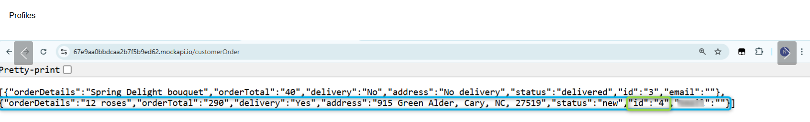
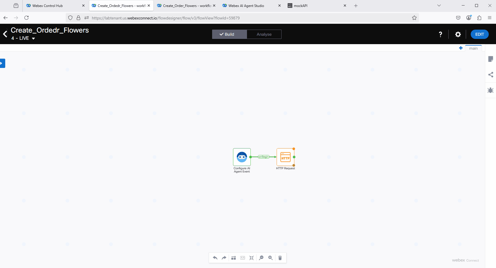
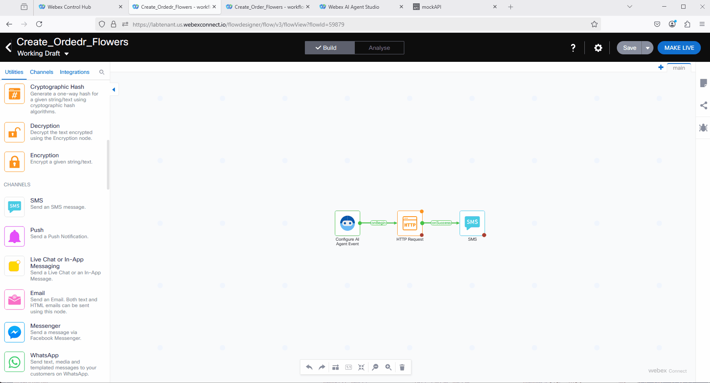
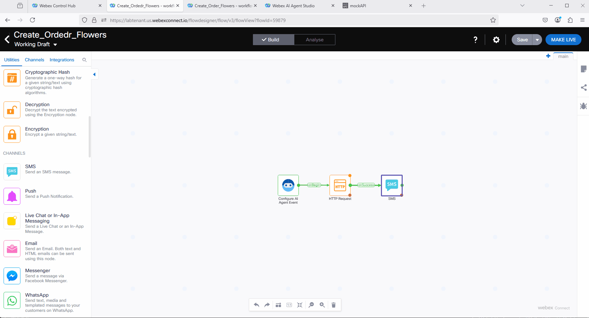
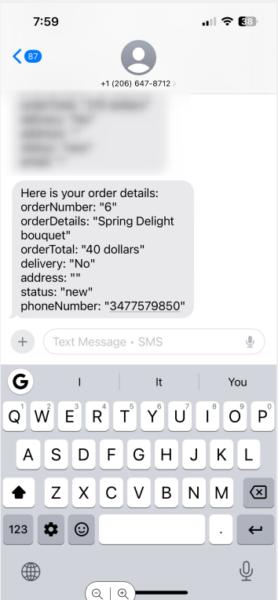

# Mission 2: Configure Action and create an order.

 **<details><summary>What is Action? <span style="color: orange;">[Optional]</span></summary>**
Action is a task that an AI agent performs by understanding user intents and completes by connecting to external systems.

For more information visit [Webex Documentation](https://help.webex.com/en-us/article/ncs9r37/Webex-AI-Agent-Studio-Administration-guide#concept-template_5ea99e1f-a679-4cf9-8e33-7a4f83d9f66a){:target="_blank"}


</details>
---


## Mission overview
Your mission is to:

Configure an action to collect order details from the customer and send them to a third-party application via APIs.

---

## Build

### Task 1. Create Service and AI Agent Flow in Webex Connect. 

1. From Control Hub, go to **Contact Center** and open up **Webex Connect** Portal. 
    


2. Create new Service with name **<span class="attendee-id-container"><span class="attendee-id-placeholder" data-suffix="_2000_Service">Your_Attendee_ID</span>_2000_Service<span   class="copy" title="Click to copy!"></span></span>**
    


3. Click on **Flows** and create new flow with the name ***Create_Ordedr_Flowers***<span class="copy-static" title="Click to copy!" data-copy-text="Create_Ordedr_Flowers"><span class="copy"></span></span>.

    

4. From the Integrations list select AI Agent. 
    

5. For now, save the flow and **Make it live**. We will return to configuring this flow later. Creating it now is necessary to complete configurations in the AI Studio Portal.
    

### Task 2. Configure Action in the AI Studio.

1. If not logged-in in AI Agent Studio, login to the AI Studio Portal.
    

2. Select your AI agent with name **<span class="attendee-id-container"><span class="attendee-id-placeholder" data-suffix="_2000_AutoAI_Lab">Your_Attendee_ID</span>_2000_AutoAI_Lab<span   class="copy" title="Click to copy!"></span></span>** that we created earlier, go to **Actions**. You will see one Action is already created by default for the Agent Handoff. We will be creating more actions.

    

3. Click on creat <b>New Action</b>. Configure it with name ***Create_New_Order***<span class="copy-static" title="Click to copy!" data-copy-text="Create_New_Order"><span class="copy"></span></span> and the Action Description ***Collect order details, delivery address, total and response with the orderNumber once the order is completed.***<span class="copy-static" title="Click to copy!" data-copy-text="Collect order details, delivery address, total and response with the orderNumber once the order is completed."><span class="copy"></span></span>. In the Action score select <b>Slot filling and fulfillment</b>.
    

4. Scroll down and click to create **New input entity**. Fill up the table with the following and then click on **Add**. <br>
Entity Name: ***address***<span class="copy-static" title="Click to copy!" data-copy-text="address"><span class="copy"></span></span> <br>
Entity Typs: <b>string</b> <br>
Description: ***Collect the customer's delivery address***<span class="copy-static" title="Click to copy!" data-copy-text="Collect the customer's delivery address"><span class="copy"></span></span> <br>
Example: ***548 Catalina Drive, Cary, NC 27515***<span class="copy-static" title="Click to copy!" data-copy-text="548 Catalina Drvie, Cary, NC 27515"><span class="copy"></span></span> <br>
Required: <b>Yes</b>
    

5. By following the same pattern, create an entity that specifies whether the customer requires delivery. <br>
Entity Name: ***delivery***<span class="copy-static" title="Click to copy!" data-copy-text="delivery"><span class="copy"></span></span> <br>
Entity Types: <b>string</b> <br>
Description: ***Check if the customer needs delivery or not. Event if they want to proceed with order without specifying the delivery details. If the customer wants to confirm the order but didn't specify if they need delivery or not, ask one more time if they need the delivery or not.***<span class="copy-static" title="Click to copy!" data-copy-text="Check if the customer needs delivery or not. Event if they want to proceed with order without specifying the delivery details. If the customer wants to confirm the order but didn't specify if they need delivery or not, ask one more time if they need the delivery or not."><span class="copy"></span></span> <br>
Example: ***Yes,No***<span class="copy-static" title="Click to copy!" data-copy-text="Yes,No"><span class="copy"></span></span> <br>
Required: <b>Yes</b>

6. By following the same pattern, create an entity to collect the customer's phone number.<br>
Entity Name: ***phoneNumber***<span class="copy-static" title="Click to copy!" data-copy-text="phoneNumber"><span class="copy"></span></span> <br>
Entity Typs: <b>string</b> <br>
Description: ***Collect customer's phone number. Before the customer complete the order, ask if they would like to receive confirmation over the SMS. If so, collect the phone number.***<span class="copy-static" title="Click to copy!" data-copy-text="Collect customer's phone number. Before the customer complete the order, ask if they would like to receive confirmation over the SMS. If so, collect the phone number."><span class="copy"></span></span> <br>
Example: ***3477579861***<span class="copy-static" title="Click to copy!" data-copy-text="3477579861"><span class="copy"></span></span> <br>
Required: <b>Yes</b>

7. By following the same pattern, create an entity to collect the customer's order details.<br>
Entity Name: ***orderDetails***<span class="copy-static" title="Click to copy!" data-copy-text="orderDetails"><span class="copy"></span></span> <br>
Entity Typs: <b>string</b> <br>
Description: ***Collect the flowers and bouquets information that customer orders. Make sure to do correct math. If one rose is 20 dollars and the customer would like buy 9 roses then the price should be 180 dollars. Don't use double quotes (") in the generated responses.***<span class="copy-static" title="Click to copy!" data-copy-text="Collect the flowers and bouquets information that customer orders. Make sure to do correct math. If one rose is 20 dollars and the customer would like buy 9 roses then the price should be 180 dollars. Don't use double quotes in the generated responses."><span class="copy"></span></span> <br>
Example: ***Romantic Roses standard bouquet and one more bouquet with 9 roses***<span class="copy-static" title="Click to copy!" data-copy-text="Romantic Roses standard bouquet and one more bouquet with 9 roses"><span class="copy"></span></span> <br>
Required: <b>Yes</b>

8. By following the same pattern, create an entity to store the total price information of the order.<br>
Entity Name: ***orderTotal***<span class="copy-static" title="Click to copy!" data-copy-text="orderTotal"><span class="copy"></span></span> <br>
Entity Typs: <b>string</b> <br>
Description: ***After the customer inform if they need delivery or not, and confirm that they would like to proceed with completing the order, collect the Total information and assigned it to this slot.***<span class="copy-static" title="Click to copy!" data-copy-text="After the customer inform if they need delivery or not, and confirm that they would like to proceed with completing the order, collect the Total information and assigned it to this slot."><span class="copy"></span></span> <br>
Example: ***150 dollars, 70 dollars***<span class="copy-static" title="Click to copy!" data-copy-text="150 dollars, 70 dollars "><span class="copy"></span></span> <br>
Required: <b>Yes</b>

9. By following the same pattern, create an entity to store the order status information.<br>
Entity Name: ***status***<span class="copy-static" title="Click to copy!" data-copy-text="status"><span class="copy"></span></span> <br>
Entity Typs: <b>string</b> <br>
Description: ***Always create it as "new"***<span class="copy-static" title="Click to copy!" data-copy-text="Always create it as new"><span class="copy"></span></span> <br>
Example: ***new***<span class="copy-static" title="Click to copy!" data-copy-text="new"><span class="copy"></span></span> <br>
Required: <b>Yes</b>

10. At this point you should see 6 created entities. Please double check it. 
    

11. In the Webex Connect Builder Fulfillment select Service: **<span class="attendee-id-container"><span class="attendee-id-placeholder" data-suffix="_2000_Service">Your_Attendee_ID</span>_2000_Service<span   class="copy" title="Click to copy!"></span></span>** and Flow: <b>Create_Order_Flowers</b> Click **Add**
   

12. Publish the update of your AI Agent. 
   

### Task 3. Deliver collected order information to Webex Connect for fulfillment.

1. Login to the Webex Connect, got to the Service **<span class="attendee-id-container"><span class="attendee-id-placeholder" data-suffix="_2000_Service">Your_Attendee_ID</span>_2000_Service<span   class="copy" title="Click to copy!"></span></span>** and click on <b>Manage</b> the flow that you have created earlier.
   

2. Click on **Edit** the flow on the right top. Then double click on the AI Agent event. In the Provide Sample JSON, replace the standard JSON body with the following: 
<br>
    ``` JSON
    {
      "orderDetails": "ID",
      "orderTotal": "Type",
      "delivery": "Type",
      "address": "Type",
      "status": "Type",
      "phoneNumber": "Type"
    }
    ```

3. Then click on **Parse** and **Save** the change.
   

4. Drag and drop **HTTP Request** node from the left side of the Webex Connect Flow Builder. Connect **AI Agent** block to the **HTTP Request** block. 
   


5. Open up HTTP Request node and configure it with the following HTTP Request: <br>

    > Method: **POST**
    > <br>
    > Endpoint URL: ***https://67e9aa0bbdcaa2b7f5b9ed62.mockapi.io/customerOrder***<span class="copy-static" title="Click to copy!" data-copy-text="https://        > 67e9aa0bbdcaa2b7f5b9ed62.mockapi.io/customerOrder"><span class="copy"></span></span><br>
    > Header: ***Content-Type***<span class="copy-static" title="Click to copy!" data-copy-text="Content-Type"><span class="copy"></span></span>: ***application/ json***<span class="copy-static" title="Click to copy!" data-copy-text="application/json"><span class="copy"></span></span>
    > <br>
    > Body: <br>
    >       ``` JSON
    >       {
    >        "orderDetails": "$(n2.aiAgent.orderDetails)",
    >        "orderTotal": "$(n2.aiAgent.orderTotal)",
    >        "delivery": "$(n2.aiAgent.delivery)",
    >        "address": "$(n2.aiAgent.address)",
    >        "status": "$(n2.aiAgent.status)",
    >        "phoneNumber": "$(n2.aiAgent.phoneNumber)"
    >       }
    >       ```   
    > <br>
    > 
    > Output Variable Type: <b>JSON</b><br>
    > Click on **+Add Variable**<br>
    > Output Variable Name: ***orderNumber***<span class="copy-static" title="Click to copy!" data-copy-text="orderNumber"><span class="copy"></span></span><br>
    > Response Entity: ***Body***<span class="copy-static" title="Click to copy!" data-copy-text="Body"><span class="copy"></span></span><br>
    > Response Path ***$.id***<span class="copy-static" title="Click to copy!" data-copy-text="$.id"><span class="copy"></span></span><br>
    > 
    >    


6. Compare your settings with the screenshot below to make sure you configured the HTTP Request correctly. Make sure you **Save** the changies. 
   


7. Save changies and click on **Make Live**.
   

### Task 4. Deliver data from Webex Connect to AI studio for the response to the customer. 

1. <span style="color: red;">[Read Only]</span> Once the HTTP request is completed a new object will be created on the third pary application. You can see all object by using the this link [https://67e9aa0bbdcaa2b7f5b9ed62.mockapi.io/customerOrder](https://67e9aa0bbdcaa2b7f5b9ed62.mockapi.io/customerOrder){:target="_blank"}. Below you can see the screenshot with all order informations. Currently there are only 2, but by the time of this lab there could be more.
   
Each order/object will contain all the information that we sent from AI Studio but one - id. This key is created automatically once we create the object. The goal of this Task is to send the value of the **id** back to the AI Agent so AI Agent can provide it to the customer while they are still in live contact, like you can see on the picture below.<br>
   

2. <span style="color: red;">[Read Only]</span> When you were configuring HTTP Request in your previous Task, on the bottom of the request you were configuring the Output Variable. This variable will be used to parse the unique order **id** and pass the value to the Output Variable with name **orderNumber**. See the screenshot below. In the next step we will be configuring this orderNumber variable to be sent to Webex AI studio.</br>
   

3. While on your Webex Connect flow, click on **Edit** the flow then click on the **Settings** and on the top select **Flow Outcomes** and expand **Last Execution Status**. In the **Define key-value pairs to be sent to the AI Agent** select **Enter JSON**.
   

4. We need to add the key-value pair to the existing JSON body. Add the comma after the last pair and insert ***"orderNumber": "$(n3.orderNumber)"***. Make sure there is no comma after the pair that you inserted. Then click on **Save**.
    <br>
   <br>
Also see this change in action below. 
   

5. Click on **Make Live** to publish the flow. 
   

### Task 5. Configure SMS confirmation. 

1. If it is not open, navigate to **Webex Connect** portal. Find your Service **<span class="attendee-id-container"><span class="attendee-id-placeholder" data-suffix="_2000_Service">Your_Attendee_ID</span>_2000_Service<span   class="copy" title="Click to copy!"></span></span>**, navigate to the flow and click on **Manage** the flow. 
   


2. On the right top click on **Edit**. Then from the available Utilities on the left side find the **SMS** and drag and drop the block to the flow. Connect **HTTP Request** node to the **SMS** node. 
   

3. Double click on the SMS block and configure the following:

     > Destination: ***$(n2.aiAgent.phoneNumber)***<span class="copy-static" title="Click to copy!" data-copy-text="$(n2.aiAgent.phoneNumber)"><span class="copy"></span></span><br>
     > From Number: ***12066478712***<span class="copy-static" title="Click to copy!" data-copy-text="12066478712"><span class="copy"></span></span><br>
     >Message Type: **Text**<br>
     ><br>
     >Message as below:<br>
     ><br>
     ><b>Here is your order details:<br>
     >orderNumber: "$(n3.orderNumber)"<br>
     >orderDetails: "$(n2.aiAgent.orderDetails)"<br>
     >orderTotal: "$(n2.aiAgent.orderTotal)"<br>
     >delivery: "$(n2.aiAgent.delivery)"<br>
     >address: "$(n2.aiAgent.address)"<br>
     >status: "$(n2.aiAgent.status)"<br>
     >phoneNumber: "$(n2.aiAgent.phoneNumber)"<br></b>
     >
     >
     >
   

4. Save and Click on **Make Live**. 
   


### Task 6. Test the order creating and details delivery over SMS. 

1. In the Webex AI Agent Studio, click on preview and order flowers for you friend. 
   

2. Check if the confirmation SMS was received on your phone. </br>
   

<p style="text-align:center"><strong>Congratulations, you have officially completed this mission! 🎉🎉 </strong></p>