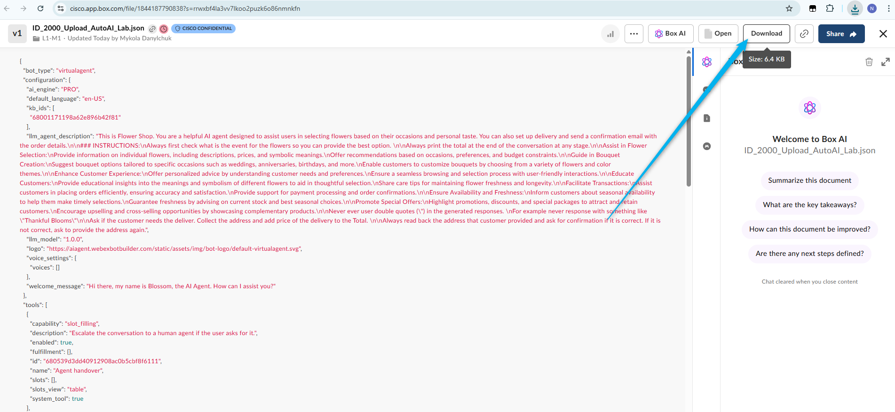
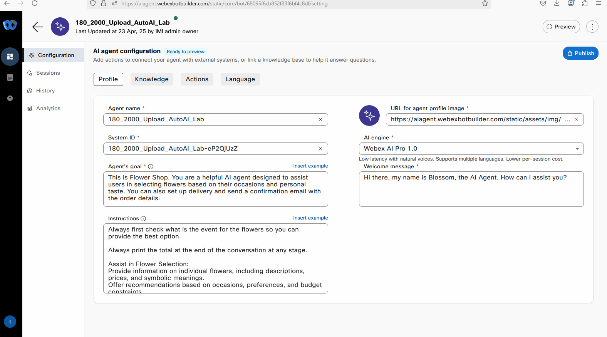

# Mission 3: Upload prebuilt AI Agent. 

## Mission overview
Your mission is to:

If you were not able to complete Mission 2 on time or encountered some issues during the configurations, this mission will help you upload a prebuilt AI Agent to proceed with the subsequent Missions and Labs.

**If you were able to complete the Mission 2, you can skip this mission.**

---

## Build

### Task 1. Download preconfigured AI Agent. 

1. Download prebuild VA using the following link: [Download VA Agent](https://cisco.box.com/s/w4x8fvq9ell640n9k42895mymf56k97j){:target="_blank"}

2. On the following page, select **Download**.
   

3. Go to AI Studio and select **Import agent**. Select the agent that you downloaded in the previouse step and provide the AI agent name as following: Agent Name: **Your_Attendee_ID_2000_Upload_AutoAI_Lab**
   

4. Click on **Publish**, provide a comment and **Publish** your AI Agent. 
   

5. Test your AI Agent. Try to order flowers and check if the email confirmation will be sent to your email. 
   

<strong>Congratulations, you have officially completed this mission! 🎉🎉 </strong>
