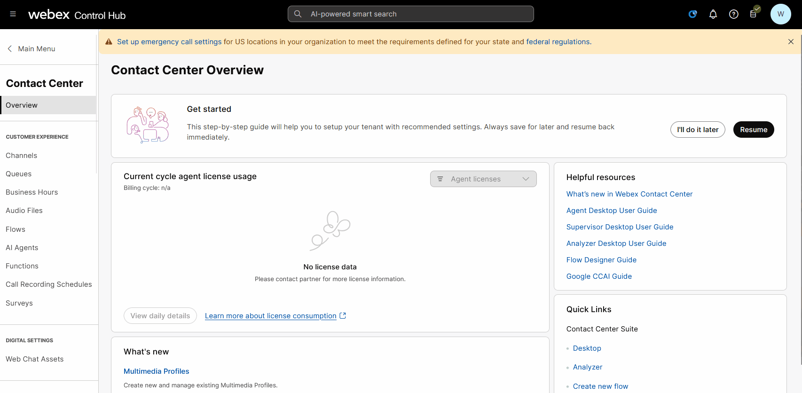
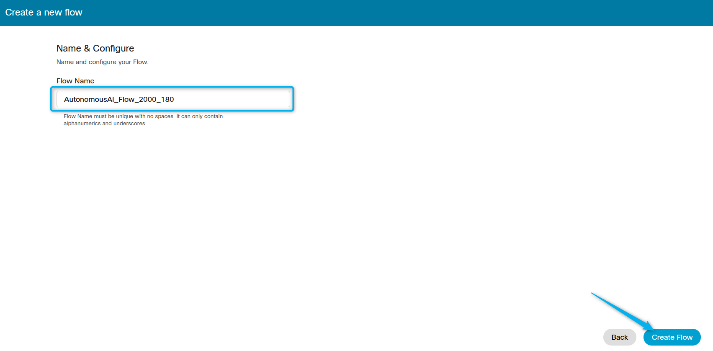
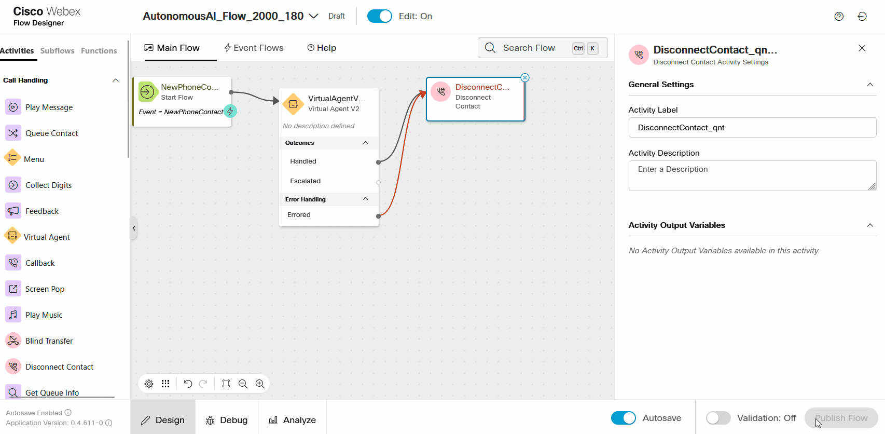
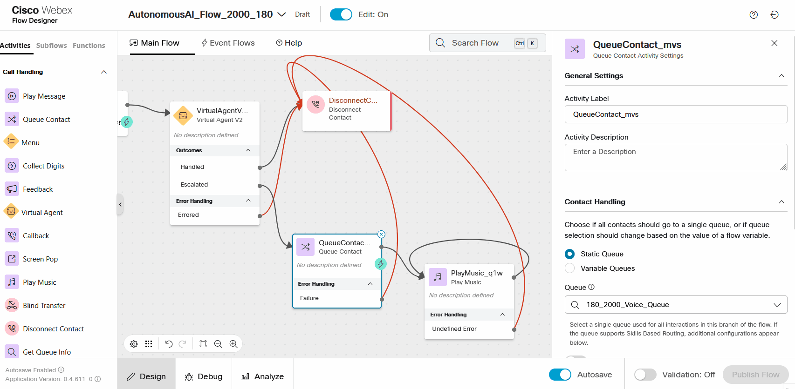
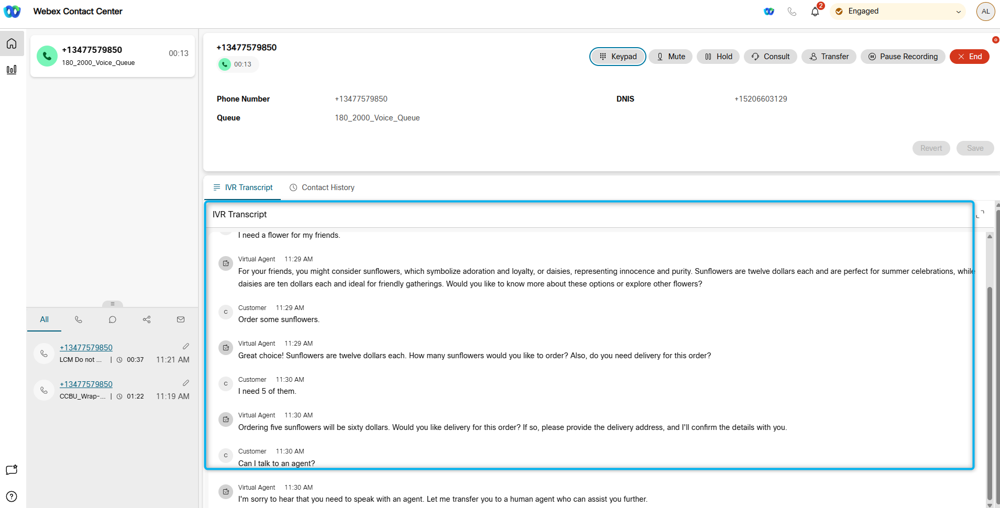

# Mission  Integrating the AI Agent with Flow for Voice Calls

## Mission overview
Your mission is to:

Integrate the AI Agent with the Voice Flow. 

### Task 1. Build WxCC voice flow with AI Agent.

1. In Control Hub navigate to **Flows**, click on **Manage Flows** dropdown list and select **Create Flows**. Select **Start Fresh**.
   

2.  Name the new flow **AutonomousAI_Flow_2000_Your_Attendee_ID** and click **Create Flow**.
   

3. Make sure the **Edit** mode at the top is set to **ON**. Then, drag and drop the **Virtual Agent V2** and **DisconnectContact** activities from the left panel onto the canvas.

    !!! Note
        Please make sure to use **VirtualAgentV2** activity and **NOT** **VirtualAgent** also present on the Activity Library for Backward Compatability.

    > Connect the **New Phone Contact** output node edge to this **VirtualAgentV2** node
    >
    > Connect the Handled outputs to **DisconnectContact** 
    >
    > Connect the Errored outputs to **DisconnectContact** 
    >
    > Click on **VirtulaAgentV2** block and select **Static Contact Center AI Config**
    >
    > Select Contact Center AI Config as **Webex AI Agent (Autonomous)**
    >
    > Virtual Agent: **Your_Attendee_ID_2000_AutoAI_Lab**
      

4. Drag and drop **Queue Contact** and **Play Music** nodes. Configure them as the following:

    - **Queue Contact** activity onto the Flow from the left side panel

      >
      > Connect the **Escalated** path from the **Virtual Agent V2** activity to the **Queue Contact** activity.
      >
      > Connect the **Queue Contact** activity to the **Play Music** activity
      >
      > Connect the **Failure** path from the **Queue Contact** activity to the **Disconnect Contact** activity.
      > 
      > Click on **Queue Contact** node and select **Static Queue**.
      > 
      > Queue name: **Your_Attendee_ID_2000_Voice_Queue**
      > 

    - **Play Music**

      >
      > Create a loop by connecting the Play Music activity back to itself - to create a music loop, following the diagram provided.
      >
      > Connect the **Failure** path from the **Play Music** activity to the **Disconnect Contact** activity.
      > 
      > Music File: **defaultmusic_on_hold_cisco_opus_no_1.wav**
      >
      

5. **Validate** and **Publish** Flow. In popped up window click on dropdown menu to select **Latest** label (**DO NOT** Select any other tag but only **Latest**), then click **Publish**.
      

6. Assign the Flow to your **Channel (Entry Point)** - Do this by first going to **Channel** > Search for your channel **Your_Attendee_ID_2000_Channel**.
7. Click on **Your_Attendee_ID_2000_Channel**
      
8. In **Entry Point** Settings section change the following:

    > Routing Flow: **AutonomousAI_Flow_2000_Your_Attendee_ID**

    > Version Label: **Latest**

    > Music on Hold: **defaultmusic_on_hold.wav**

    

9. Dial Support Number assigned to your **Your_Attendee_ID_2000_Channel** to test the Autonomous AI Agent over a voice call.

### Task 2. Test Agent Handoff Configurations.

1. From the browser start logging in to [Agent Desktop](https://desktop.wxcc-us1.cisco.com){:target="_blank"} with the same credentials. You will see another login screen with OKTA on it where you may need to enter the email address again and the password provided to you. 
2. Select **Desktop** endpoint option and choose the team. **Your_Attendee_ID_2000_Team**. Click **Submit**. Allow browser to access Microphone by clicking **Allow** on every visit.
3. Make your agent ***Available*** and you're ready to make a call.

    

4. Dial the support number assigned to your **Your_Attendee_ID_2000_Channel** channel, and during the conversation with the AI agent, ask to talk to a representetive or live agent. 

5. By default, the **Conversation Transcripts** setting is enabled in VirtualAgentV2 block.
    

6. With this setting enabled, the live agent can see the conversation details between the caller and the AI agent. Please check if you can view the IVR transcripts during your test calls with Agent Handoff. 
    

<strong>Congratulations, you have officially completed the Autonomous AI Agent lab! 🎉🎉 </strong>

