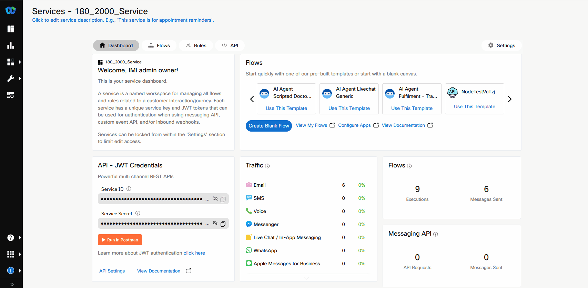

## Introduction

## Mission Objective

In this mission, you will download the Webex Connect flow and configure it to work with you Webex AI agent. 

## Build

### Task 1. Configure Webex Connect Flow. 

1. Download the Webex Connect flow using the following link:
[Webex Connect Flow](https://cisco.box.com/s/w1iqxeeoz2k6abl68lhmhijv9g0jtcy5){:target="_blank"}

2. Go to Webex Connect portal and open your service with the name **Your_Attendee_ID_2000_Service**
   

3. Click on **Flows** and then click on **Create Flow**.
   

4. Name the flow as **Chat_AI_Agent_Your_Attendee_ID** and select **Upload flow** option from the list.
   

5. Click on **Choose File**, select the fild that you have downloaded in the step 1, then click on **Create**.
   

6. On the following page click on **Save**
   