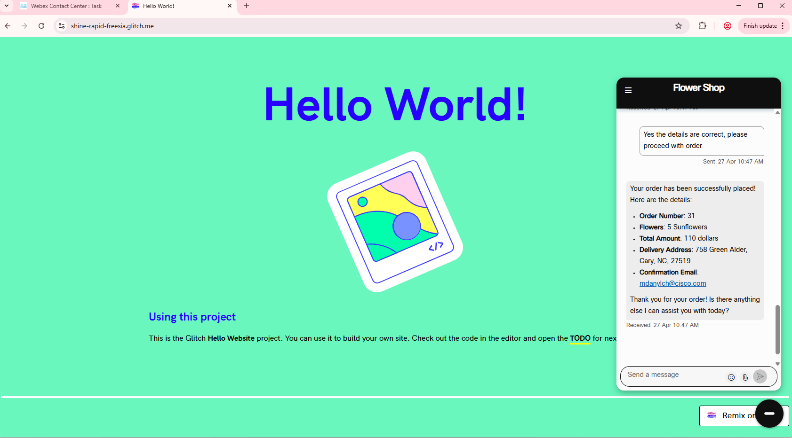
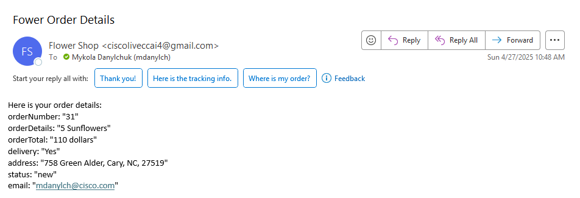
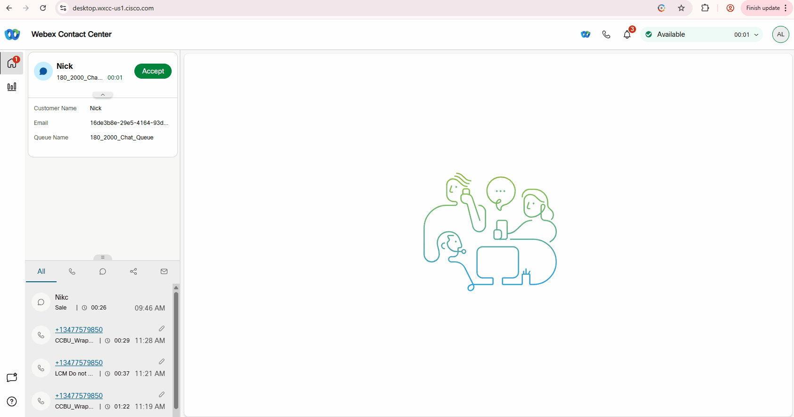

## Mission Objective

In this mission, you will test the conversation with an AI Agent over the Chat Digital Channel, as well as test the chat transfer to a human agent.

## Test

### Task 1. Test conversation with AI Agent.

1. Open up website that is related to your account and initiate the chant. Order flowers with delivery and email confirmation.
   

2. You should also receive the confirmation email to the specifed email address. 
   

### Task 2. Test the handoff to a human agent.

1. During conversation with AI agent ask to talk to a live agent. 
   

2. Login to [Agent Desktop](https://desktop.wxcc-us1.cisco.com){:target="_blank"} with your agent credentials to receive the test chat. You should see the transcripts with details of what the customer was discussing with the AI Agent before the conversation was handed off to the live agent.
   

<strong>Congratulations, you have officially completed this mission! 🎉🎉 </strong>
