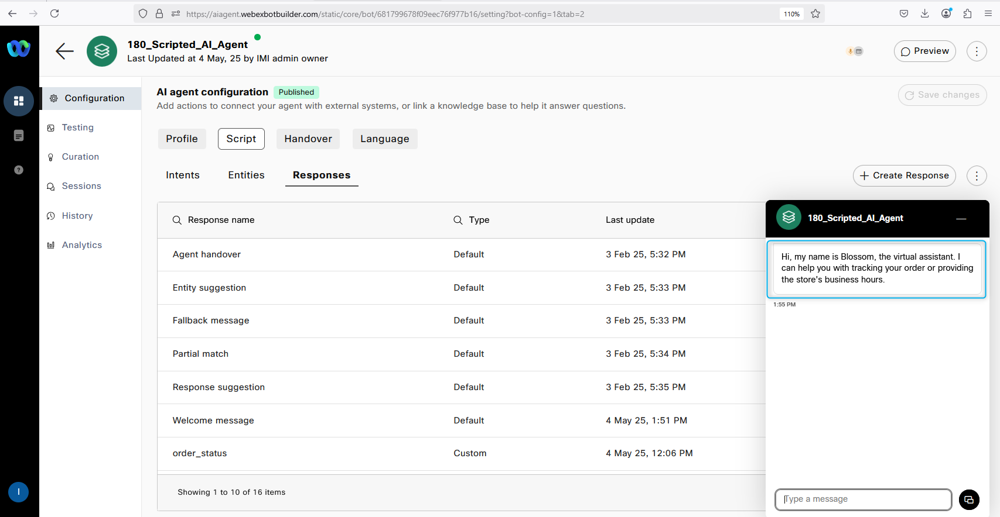
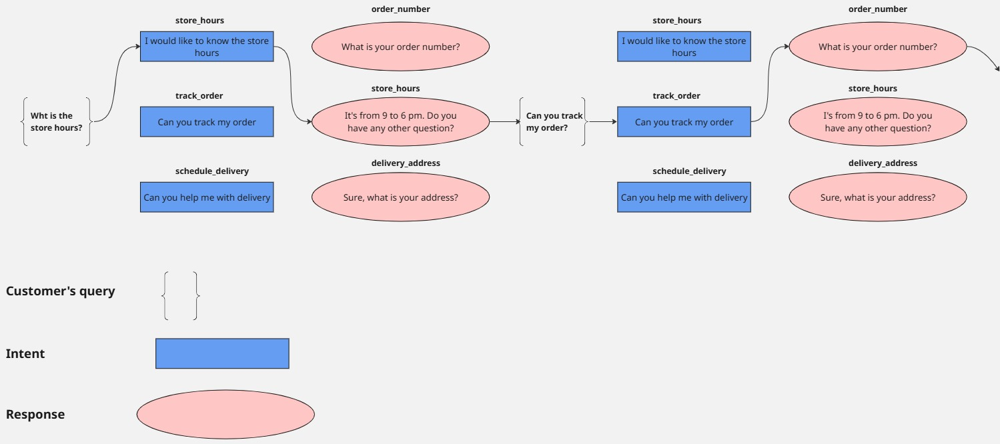
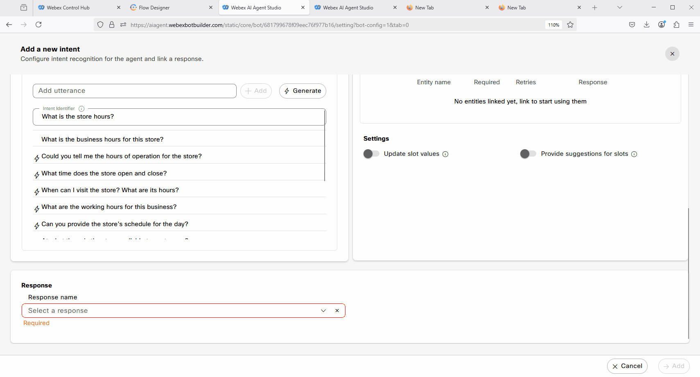
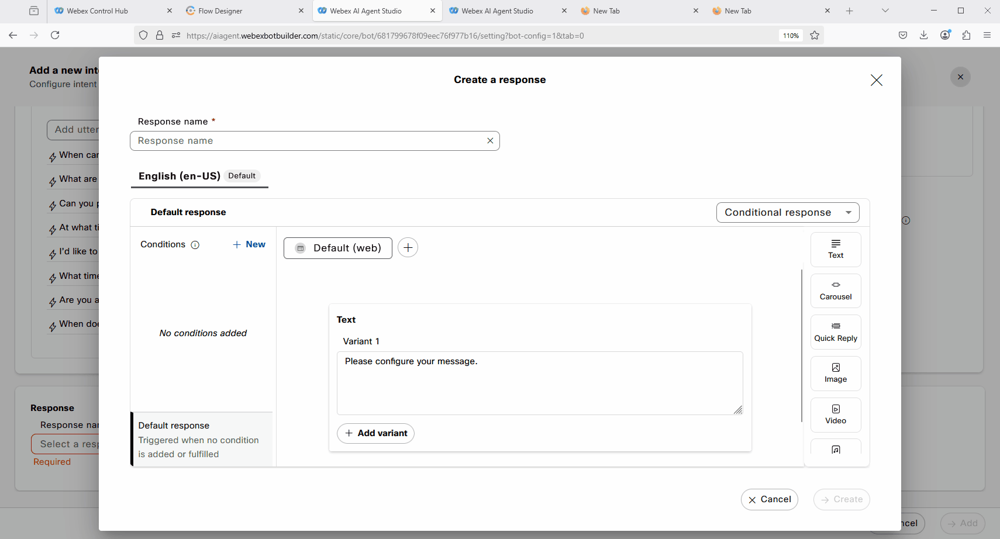
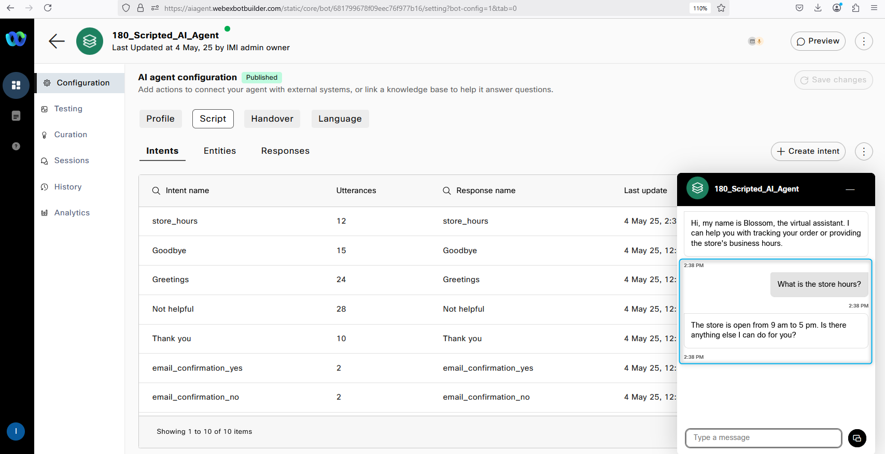

### Mission Details

Your mission is to create a new Scripted AI Agent from the template and configure basic Scripted AI Agent functionalities by adding intents and responses.

### Build

#### Task 1. Creating a AI Agent using a Template

1. [IMPORTANT] Download the [Scripted Agent](https://drive.google.com/file/d/1HjXCeIJ4TkcW8XOIHePVKa6pVi6Lw2sO/view?usp=sharing){:target="_blank"}.
     

2. Login in to [Webex Control Hub](https://admin.webex.com){:target="_blank"} by using your Admin profile **wxcclabs+admin_IDYour_Attendee_ID@gmail.com**. You will see another login screen with OKTA on it where you may need to enter the email address again and the password provided to you.

3. Go to Contact Center from the left side navigation panel, and under Quick Links, click on **Webex AI Agent**

      

4. Click on **Import agent** to create a new AI Agent by importing preconfigured template. Click on **Upload** button, locate and select **ScriptedAIAgent.json** you downloaded at the beginning of the mission.
5. Name your Agent as **Your_Attendee_ID_Scripted_AI_Agent** and click **Import**
6. Make the bot live by clicking on **Save Changes** and then **Publish** button on top right.
7. Enter **v1** in the popup comment window, then click **Publish**.
    

8. Click on the **Preview** button on the top right side to test the bot. Try the bot flow by typing ***"What are the store hours?"***
You will notice the following response: 
>Sorry, I was unable to understand your query accurately.
    
     

9. The initial response can be customized, and we also need to configure intents and responses to enable the Scripted AI Agent to answer questions about store hours.

#### Task 2. Update the initial greeting.  

1. As soon as the interaction reaches the Scripted AI Agent, the system initiates the **Welcome** response. To change the initial greeting, go to **Script** > **Responses** then open the **Welcome** response and update the response text there. Change the text to: ***Hi, my name is Blossom, the virtual assistant. I can help you with tracking your order or providing the store's business hours.***.  
Please do it for **Web** and Voice **channels**. After the change, Save and Publish the Scripted AI agent. 
     

2. Click on the **Preview** button on the top right side to test the bot. Check if the initial greeting was changed. 
     

#### Task 3. Configure Scripted AI agent to answer questions about store hours. 

1. Before we move on with adjusting and configuring intents and responses, it is important for you to understand the flow of the Scripted AI Agent. Once a customer asks a question, the AI engine and Natural Language Understanding (NLU) service tries to match it to an intent based on the training phrases. The intent is then configured with a response. After the customer receives the response, they can ask another question, and the same process applies. The AI engine and NLU match the customer’s query to an intent, which is configured with a response. Additionally, fulfillment can also be configured as part of the response. This is the basic flow concept of the Scripted AI Agent.
     

2. While on the **Script** configuration page, switch to **Intents** tab and click on the **Create Intent** button located in the top right corner.
3. Add a new intent by providing the intent name as ***store_hours*** and include the following two utterances:

    - ***What are the store hours?***
    - ***What is the business hours for this store?***
     

4. Click on the **Generate** button to utilize Generative AI for creating additional training phrases.

5. Enter a description such as ***Generate intents store business hours*** Set the Number of Variants to **10**, which will determine the number of new phrases to be generated. Click **Generate**
> Make a note of newly created **Utterances**
     

6. Now we need to configure a response that would be related to this intent. Scroll down and click on **Create new**.
     

7. Name the response as ***store_hours***. Update Variant 1 text to ***The store hours are from 9 am to 5 pm. Please let me know if you have any other questions.***.
Move to next step before clicking **Create**
     

8. Add one more Variant and provide the text: ***The store is open from 9 am to 5 pm. Is there anything else I can do for you?***.
     

9. Add **Voice Channel**.
     

10. Configure **Voice Channel** with the same Variants and click on **Create**.  
***The store hours are from 9 am to 5 pm. Please let me know if you have any other questions.***. 
***The store is open from 9 am to 5 pm. Is there anything else I can do for you?***.
     

11. Now after we added the response to our intent we can complete the intent configuration. Click on **Add** on the right bottom corner. **Save** and **Publish** the Scripted AI Agent. 
     

12. Click on the **Preview** button on the top right side to test the bot. Try the bot flow by typing ***"What are the store hours?"***
     

<strong>Congratulations, you have officially completed this mission! 🎉🎉 </strong>

