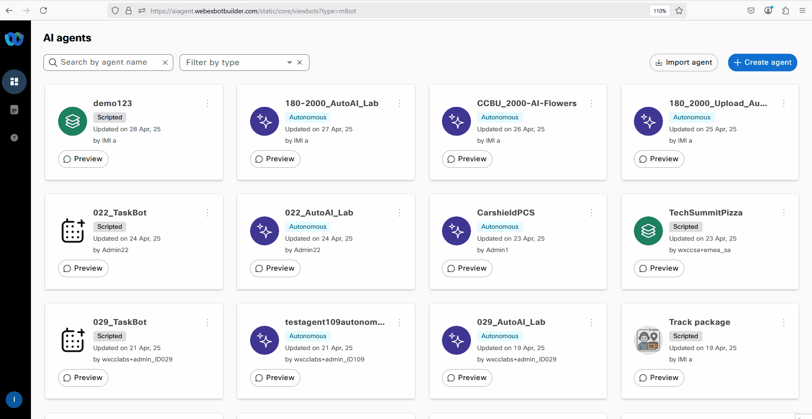
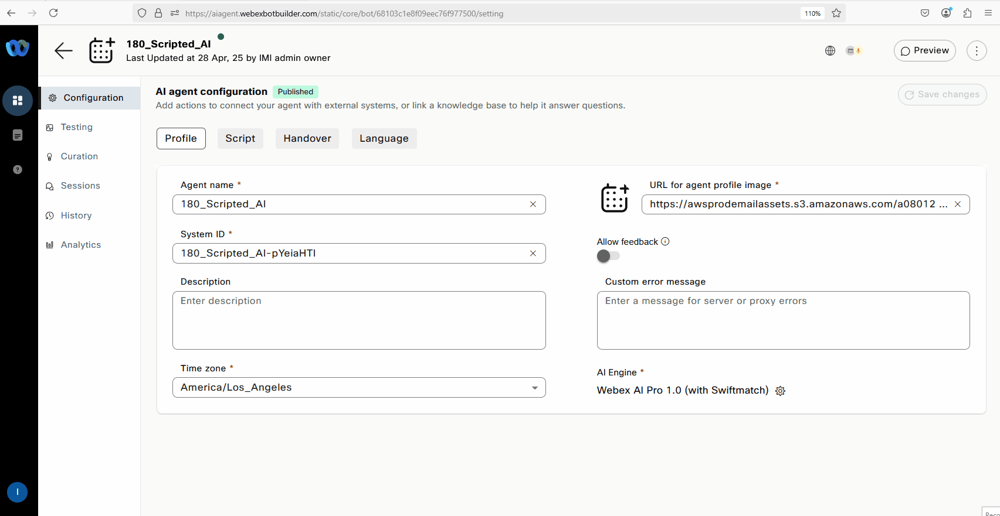
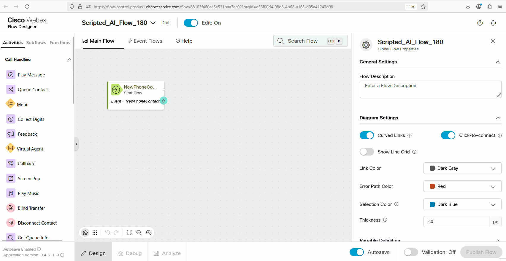
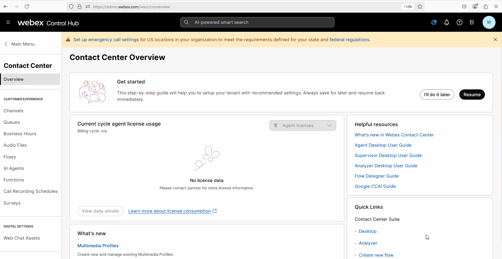
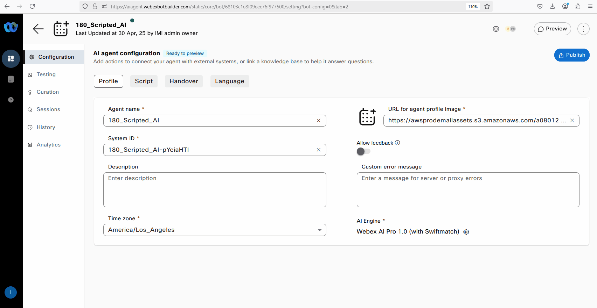
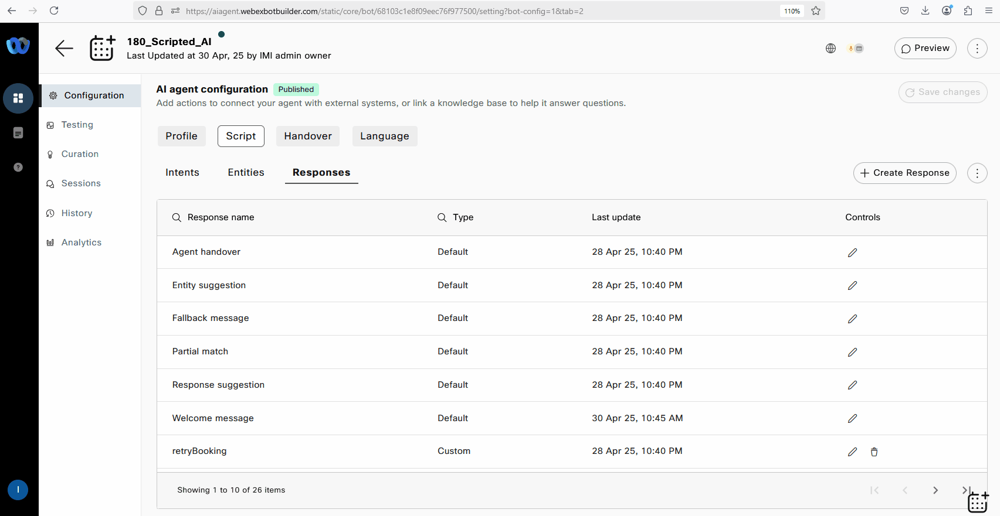
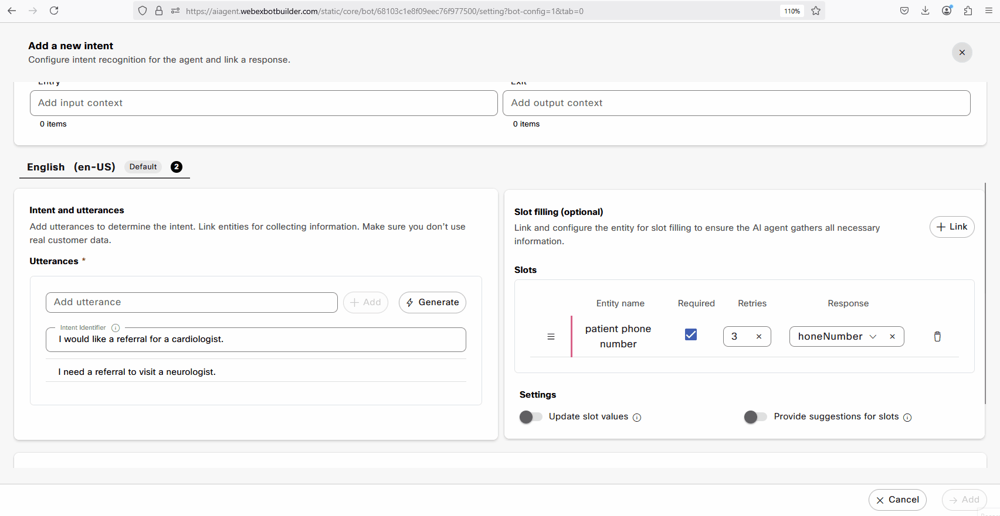
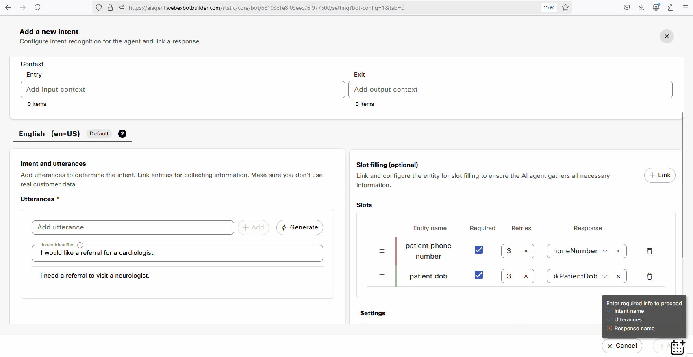
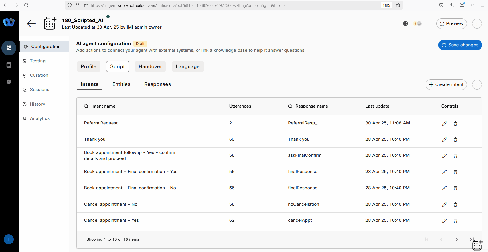
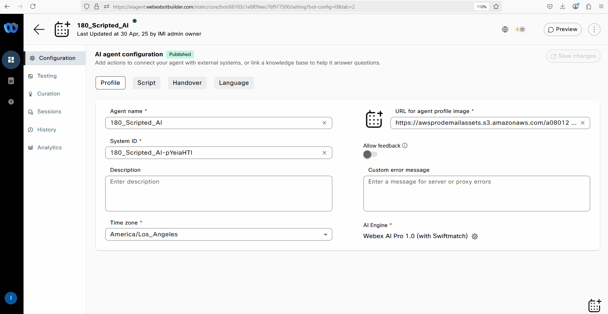

### Mission Details

This mission is designed to provide an in-depth understanding of the Scripted AI Agents. By completing this section of the lab, you will:

- Gain practical skills and knowledge on how to effectively utilize Scripted AI Agent to create self-service automation.
- Improve the containment rate of your contact center, increasing efficiency and reducing costs.
- Understand the use of Generative AI to fast-track AI Agent development and save time.
- Troubleshoot the Scipted AI Agent functionality to enhance performance.

### Build

#### Task 1. Creating a AI Agent using a Template

1. [IMPORTANT] Download the [Scripted Agent](https://cisco.box.com/shared/static/q636qc41q0brifn0h8anbfug7duq3536.json){:target="_blank"}.
    
    > 
    > **ScriptedAIAgent.json** - The Appointment Booking template for the AI Agent in Webex Contact Center enables customers to schedule, reschedule, or cancel appointments through an AI-powered virtual agent, integrating with backend systems for real-time availability and confirmations.
    >

2. Login into [Webex Control Hub](https://admin.webex.com){:target="_blank"} by using your Admin profile **wxcclabs+admin_IDYour_Attendee_ID@gmail.com**. You will see another login screen with OKTA on it where you may need to enter the email address again and the password provided to you.

3. Go to Contact Center from the left side navigation panel, and under Quick Links, click on **Webex AI Agent**

      

3. Click on **Import agent** to create a new AI Agent by importing preconfigured template. Click on **Upload** button, locate and select **ScriptedAIAgent.json** you downloaded at the beginning of the mission.
4. Name your Agent as **Your_Attendee_ID_Scripted_AI** and click **Import**
5. Make the bot live by clicking on the **Publish** button on the top right.
6. Enter **v1** in the popup window, then click **Publish**.
    

7. Click on the **Preview** button on the top right side to test the bot. Try the bot flow by typing ***"I would like to cancel an appointment"***

    <!-- md:option type:note -->
    
    !!! note "Sample Conversation"
        **AI Agent**: Welcome to Cumulus Healthcare. How may I assist you today? 
        **You**: I would like to cancel an appointment 
        **AI Agent**: Please provide the patient's 6-digit insurance number. 
        **You**: 123456 
        **AI Agent**: Please provide your 10-digit phone number. 
        **You**: 0123456789 
        **AI Agent**: You have an appointment on 20/01/2025 at 15:00. Would you like to cancel it? 
        **You**: yes 
        **AI Agent**: Your appointment for 20/01/2025 at 15:00 is cancelled. 

    

---

#### Task 2. Integrating the Bot with Flow for Voice Calls

1. In Control Hub navigate to **Flows**, click on **Manage Flows** dropdown list and select **Create Flows**

2. Select **Start Fresh** and name the new flow **Scripted_AI_Flow_Your_Attendee_ID**.
     

3. Make sure the **Edit** mode at the top is set to **ON**. Then, drag and drop the **Virtual Agent V2** and **DisconnectContact** activity from the left panel onto the canvas.

    !!! Note
        Please make sure to use **VirtualAgentV2** activity and **NOT** **VirtualAgent** also present on the Activity Library for Backward Compatability.

    > Connect the **New Phone Contact** output node edge to this **VirtualAgentV2** node
    >
    > Connect the Handled outputs to **DisconnectContact** 
    >
    > Connect the Escalated outputs to **DisconnectContact** 
    >
    > Connect the Errored outputs to **DisconnectContact** 
    >
    > Select **Static Contact Center AI Config**
    >
    > Contact Center AI Config: **Webex AI Agent (Scripted)**
    >
    > Virtual Agent: **Your_Attendee_ID_Scripted_AI**

4. On bottom right corner toggle **Validation** from **Off** to **On**
5.  Click **Publish** Flow. In Popped up window click on dropdown menu to select **Latest** label, then click **Publish**
     

6. Assign the Flow to your **Channel (Entry Point)** - Do this by first going to **Channel**, search for your channel **Your_Attendee_ID_2000_Channel**.
7. Click on **Your_Attendee_ID_2000_Channel**
8. In **Entry Point** Settings section change the following:

    > Routing Flow: **Scripted_AI_Flow_Your_Attendee_ID**

    > Version Label: **Latest**

    

9. Dial Support Number assigned to your **Your_Attendee_ID_2000_Channel** to test the Virtual Agent over a voice call.

---

#### Task 3. Updating Bot Responses

In this step, we will learn how to update bot responses and test these changes, both in preview mode and by making a live call. Testing in preview mode allows you to ensure the changes worked as expected, while making a live call confirms the bot's performance in a real-world scenario.

1. Login into [Webex Control Hub](https://admin.webex.com){:target="_blank"} by using your Admin profile **wxcclabs+admin_IDYour_Attendee_ID@gmail.com**. You will see another login screen with OKTA on it where you may need to enter the email address again and the password provided to you.

2. Go to Contact Center from the left side navigation panel, and under Quick Links, click on **Webex AI Agent**

      

3. Search and open your bot **Your_Attendee_ID_Scripted_AI** that you created earlier. 
    

4. In the **Configuration** menu navigate to **Script** tab, then **Responses** tab
    
    >
    > Select the **Welcome message** in **Default message**
    >
    > Update the text to ***"Welcome to Cumulus Healthcare. We are here to help. How may I assist you today?"*** for the Default (web) channel.
    >
    > Switch to the Voice Channel and update the text to ***"Welcome to Cumulus Healthcare. We are here to help. How may I assist you today?"***
    >
    > Click on the **Save** button to confirm the changes. Make the bot live by clicking on the **Publish** button. Add a version name on pop-up window and click **Publish** again. 

    

5. Click on **Preview** to test if the Greeting has been successfully updated.

    

---

#### Task 4. Adding New Intents & Entities

In this step, we will learn how to add new intents and entities to enhance the bot's ability to understand and respond to a broader range of user inputs. These updates will be tested in both preview mode and during a live call to confirm that the bot correctly identifies the new intents and entities and provides appropriate responses.

1. While on the **Script** configuration page, switch to **Intents** tab and click on the **Create Intent** button located in the top right corner.
2. Add a new intent by providing the intent name as ***ReferralRequest*** and include the following two utterances:

    - ***I would like a referral for a cardiologist.***
    - ***I need a referral to visit a neurologist.***

    

3. Click on **+ Link** and add **patient phone number** as an entity.

    >
    > Check the **Required** checkbox 
    >
    > Select the template key as **askPhoneNumber**, which will be used to prompt the patient for their phone number.

        

4. Again, click on **+ Link** and add **patient dob** (date of birth) 

    > 
    > Check **Required** checkbox
    > 
    > Select the template key as **askPatientDob**. When this intent is matched, it will trigger the Virtual Agent to ask the user to provide their phone number and date of birth for verification purposes.

      

5. On the same page in **Response** section at the bottom, click on **Select a response** drop down list and scroll down to **Create new**.

    > 
    > Template key: **ReferralResp_**
    > 
    > On **Default (Web)** tab replace the text with: ***Your request has been logged and will be reviewed by our team. You will receive a callback once it's approved. Is there anything else I can assist you with?***
    >
    >> [Optional]: Adding text to a **Voice** is not mandatory as **Default (Web)** works here as well. But you can slightly change the message depending on the channel.
    >>  
    >> Click on **+** next to **Default (Web)** and select **Voice**
    >>
    >> In the Text section replace the text with: ***Your request has been logged and will be reviewed by our team. You will receive a callback once it's approved. Is there anything else I can assist you with?***
    >
    > Click on **Create**.
    > Click on **Add**.
    

 6. Click on the **Save Changes** button to confirm the changes. Make the bot live by clicking on the **Publish** button. Add a version name on pop-up window and click **Publish** again. 

    

7. Use the **Preview** feature to test the bot flow with the input query: ***I need a referral for a cardiologist***. 
10. You can also test this interaction in voice mode by dialing the Supported Number assigned to your pod.

    

---

#### Task 5. Adding Training Data using Generative AI

In this step, we will learn how to enhance the bot's capabilities by adding training data using generative AI and validate the changes by making a call.

1. While on the **Script** configuration page, navigate to **Intents** tab and select **ReferralRequest** intent that you created in the previous exercise.

2. Click on the **Generate** button to utilize Generative AI for creating additional training phrases.

3. Enter a description such as ***"Generate intents for requesting a referral to different doctor specialties from primary care."*** Set the Number of Variants to **10**, which will determine the number of new phrases to be generated.

4. Click on **Save**.

5. Click on the **Save Changes** button to confirm the changes. Make the bot live by clicking on the **Publish** button. Add a version name on pop-up window and click **Publish** again. 

    

6. Test the updated bot flow by using the **Preview** button and inputting queries related to the new training data.

    

---

#### Bot Transcripts & Analytics

In this step, we will explore how to access and analyze bot transcripts and analytics to gain insights into user interactions.

1. Click on **Sessions** in the left-hand panel of your bot builder interface to view all the call history. Click on any Session ID to delve into a more detailed analysis of that particular interaction.

2. If you encounter encrypted content, click on **Decrypt Content** to proceed with the review.

3. Review the transcript for the selected interaction to gain insights into how the conversation unfolded.

    

4. Click on individual messages from the user to examine the intents and entities identified by the Virtual Agent during the conversation.

5. By carefully analyzing these transcripts and analytics, you can identify areas for improvement, understand user behavior, and refine the Virtual Agent's performance accordingly. 

    

<strong>Congratulations, you have officially completed the Cisco Virtual Agent mission! 🎉🎉 </strong>

