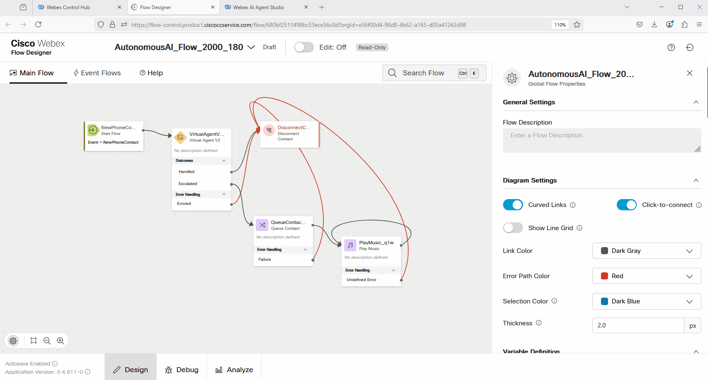
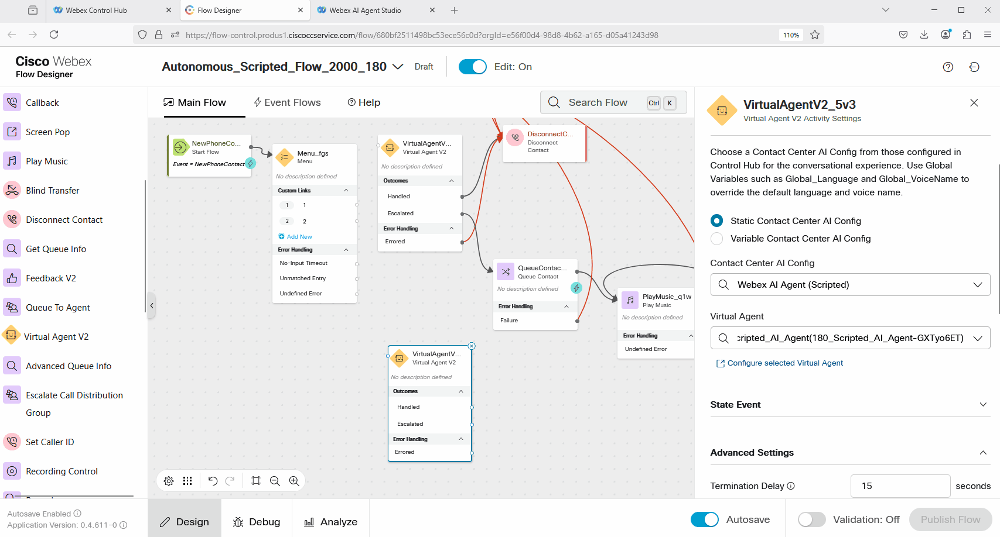
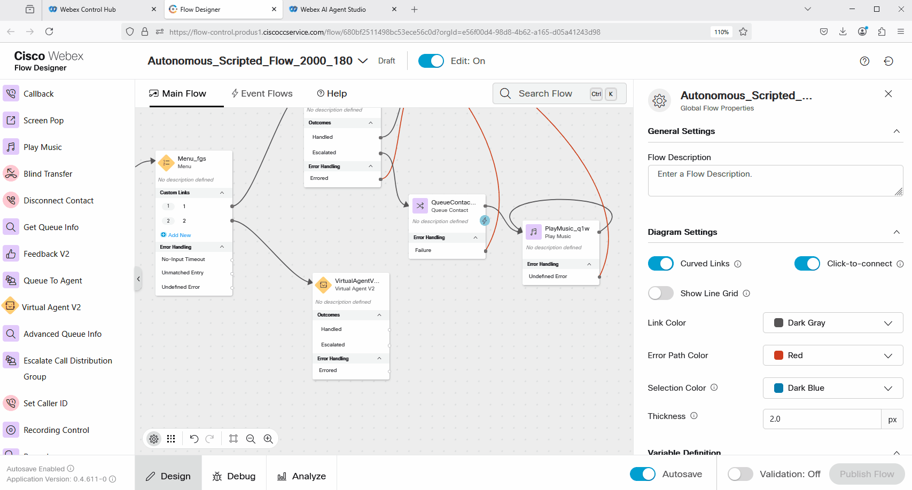
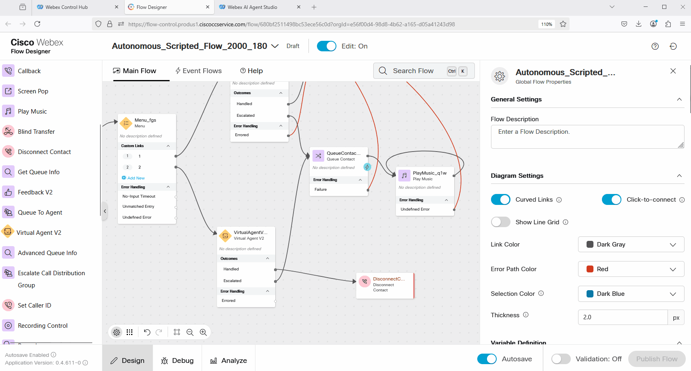
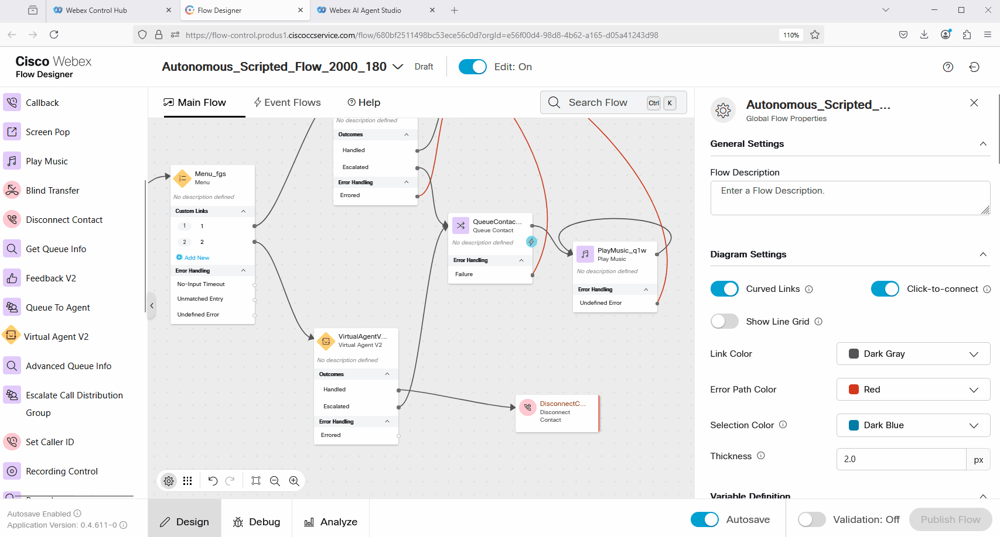

### Mission Details

Your mission is to integrate the Scripted AI agent with Voiceflow to enable it to answer questions about store hours.

### Build

#### Task 1. Add the newly created Scripted Agent to the Voice flow. 

1. In [Control Hub](https://admin.webex.com){:target="_blank"} go to **Contact Center**, click on **Flows**, and search for the flow with name **AutonomousAI_Flow_2000_Your_Attendee_ID**. Or if you created the flow with a different name in the lab "Autonomous AI Agent, try to find your flow. 
     

2. Click on Edit and rename the flow to **Autonomous_Scripted_Flow_2000_Your_Attendee_ID**. Publish the flow. 
     

3. Add **Menu** node in front of the VirtualAgentV2 node. 
     

4. Click on the **Menu** node and Enable Text-to-Speech. Select native **Cisco Cloud Text-to-Speech** connector, add Text-to-Speech message, remove the Audio File option. Finally enter the text: ***Press 1 to create a new order. Press 2 to track an order or check the store hours.***
     

5. Adjust the **Menu** node to have options 1 and 2. 
     

6. Bring one more VirtualAgentV2 node. Click on it. In the Contact Center AI Config search for scripted and select **Webex AI Agent (Scripted)**. Under the Virtual Agent option, search for the Scripted AI Agent with name **Your_Attendee_ID_Scripted_AI_Agent**.
     

7. Connect Option 1 of the **Menu** to the **VirtualAgentV2** node that is configured with Autonomous AI agent. And connect Option 2 to the **VirtualAgentV2** node that is configured with your Scripted AI Agent. 
     

8. Connect Escalated output from the **VirtualAgentV2** node to the **Queue** node. Connect Handled output to the **Disconnect Contact** node. 
     

9. Validate and Publish the Flow. 
     

10. From Control Hub, make sure that the Channel **Your_Attendee_ID_2000_Channel** is configured with **Autonomous_Scripted_Flow_2000_Your_Attendee_ID**.
     

11. Dial the number that is associated with **Your_Attendee_ID_2000_Channel** Channel. 
     

12. During IVR, press 2 and ask **What is the store hours?**

<strong>Congratulations, you have officially completed this mission! 🎉🎉 </strong>
