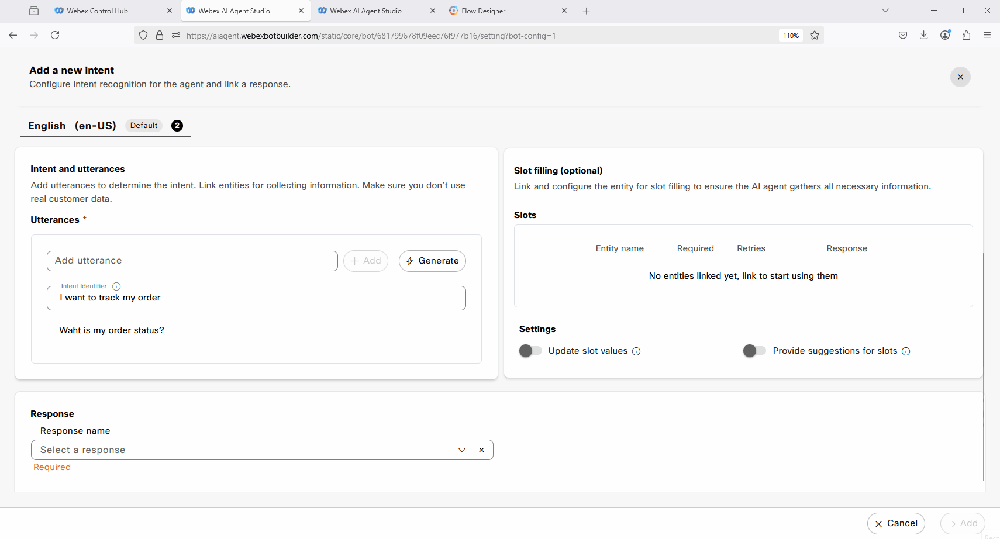
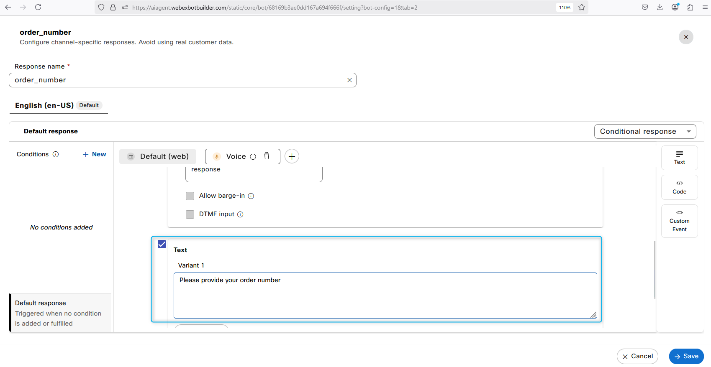
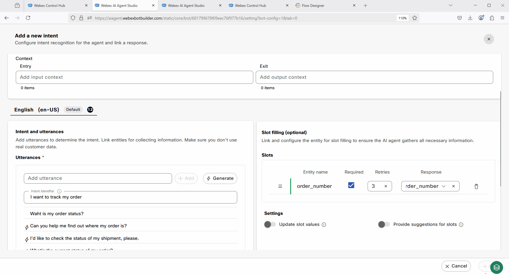
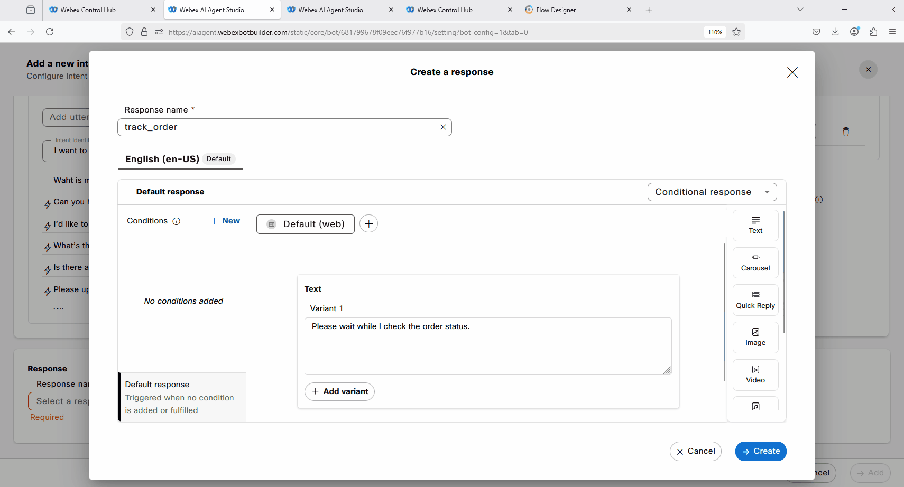

### Mission Details

Your mission is to configure intents, entities, and responses to check the status of an existing order that you created in the **Autonomous AI Agent** lab. In the next **Mission 4**, you will configure Fulfillment for this order tracking flow.

### Build

#### Task 1. Test the Order tracking flow. 

1. Click on the **Preview** button on the top right side to test the bot. Try the bot flow by typing ***"I want to track my order"***. You will see that the Scripted AI agent is not yet configured to assist with this task.
     

#### Task 2. Configure intents, entities, and responses.

1. While on the **Script** configuration page, switch to **Entities** tab and click on the **Create entity** option. Provide the name as ***order_number***. Entity type select as **Digits**. Provide **Length** as ***2***.
     

2. While on the **Script** configuration page, switch to **Intents** tab and click on the **Create Intent** button located in the top right corner.
3. Add a new intent by providing the intent name as ***track_order*** and include the following two utterances:

    - ***I want to track my order***
    - ***What is my order status?***
    

4. Click on the **Generate** button to utilize Generative AI for creating additional training phrases.

5. Enter a description such as ***Generate intents to track an order status*** Set the Number of Variants to **10**, which will determine the number of new phrases to be generated.
     

6. Click on **+ Link** and add **order_number** as an entity.Make it as **Required**. Click on the **Response** search and select **order_number** response. .
        

7. You can review it later, but for your information, the **order_number** response was preconfigured for you for this lab. In this response, the AI agent simply asks for the order number. Refer to the picture below. This is an interim response needed to fill the entity.
      

8. Scroll down and click on **Create new** response. 
      

9. Name the response as ***track_order***. Update variant 1 test to ***Please wait while I check the order status.***.
     

10. Add **Voice Channel**.
     

11. Configure **Voice Channel** with the same variants and click on **Create**.  
***Please wait while I check the order status.***.
     

12. Now after we added the response to our intent we can complete the intent configuration. Click on **Add** on the right bottom corner. **Save** and **Publish** the Scripted AI Agent. 
     

13. Click on the **Preview** button on the top right side to test the bot. Try the bot flow by typing ***"I would like to track my order"*** and provide an order number that you created earlier. 
     

<strong>Congratulations, you have officially completed this mission! 🎉🎉 </strong>
