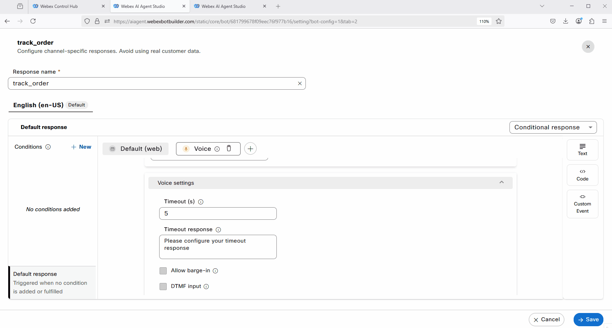
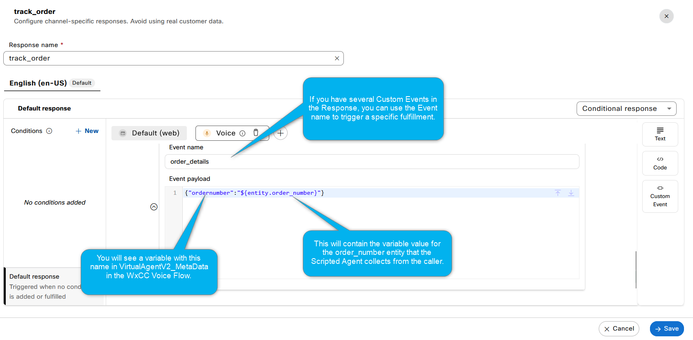
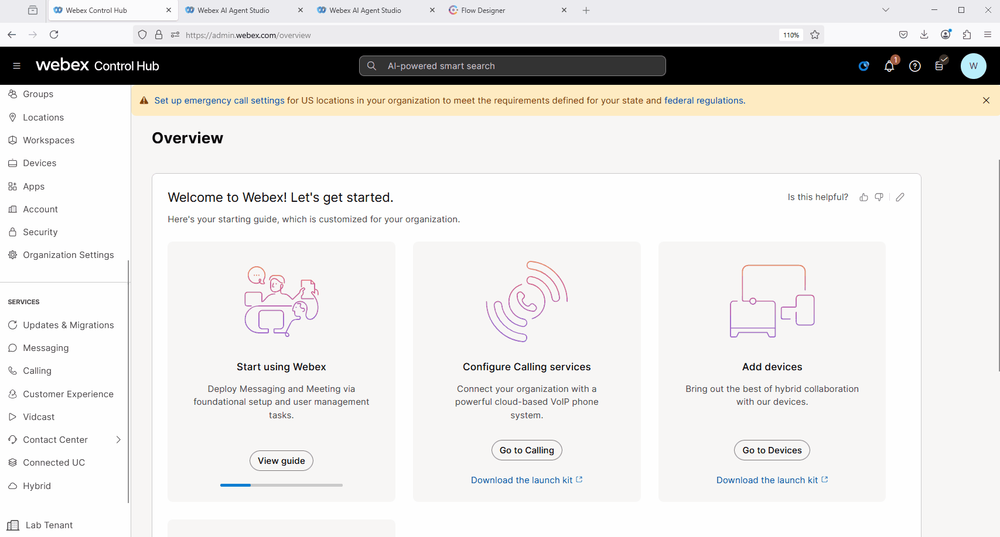
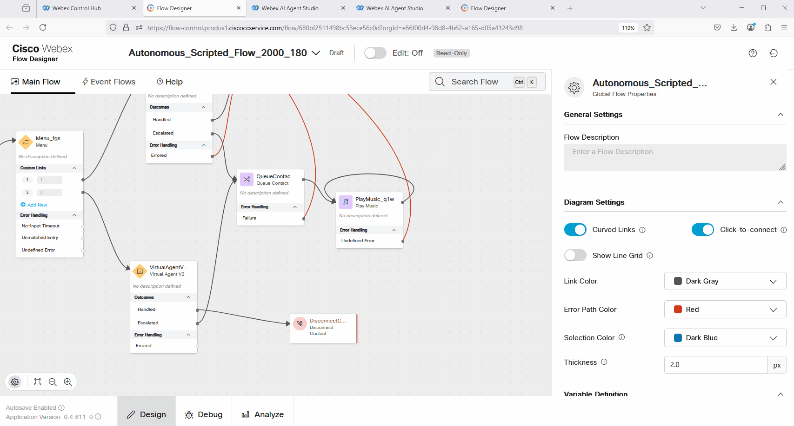
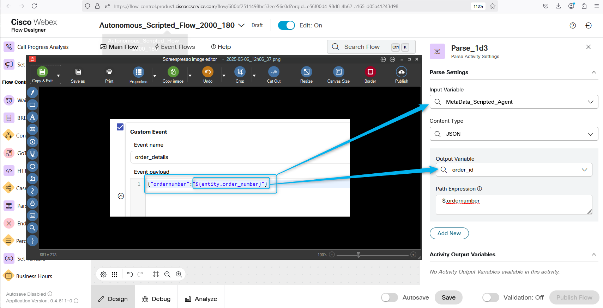
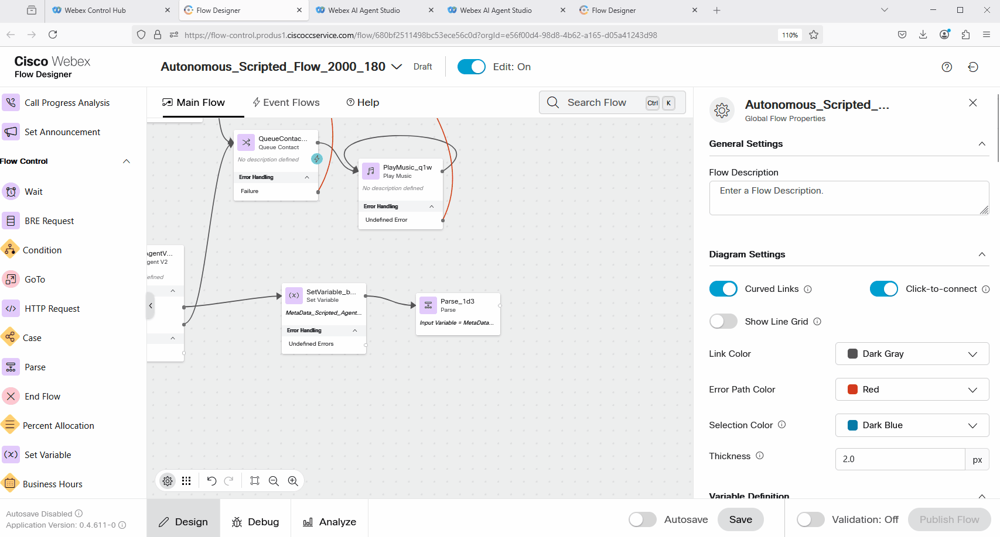
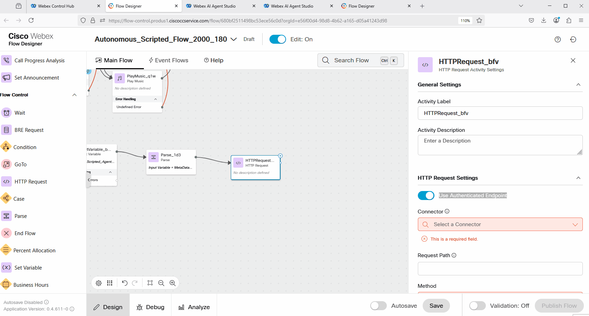
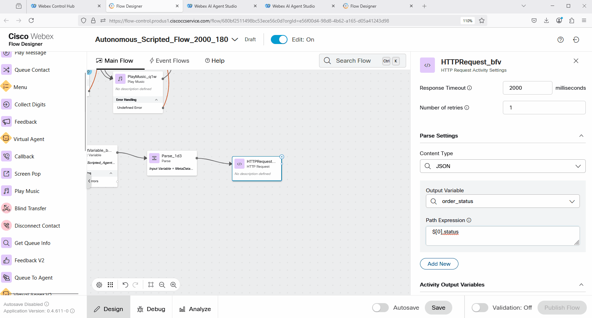

### Mission Details

In the previous **Mission 3**, you created intents, entities, and responses to enable the Scripted Agent to understand and respond to order-tracking requests. However, no logic or API calls were configured yet to retrieve the order information. In this mission, you will configure the fulfillment flow to use an API call to retrieve the order status and send it back to the caller.

### Build

#### Task 1. Configure a Custom Event to send data from AI Studio to WxCC Voice Flow. 

1. The fulfillment for Scripted AI Agent currently is done in the WxCC Voice Flow in order to comply with all policies and regulations.

2. Open up **AI Studio** portal go to **Scripts** > **responses** and open up response ***track_order***. Go to Voice Channel. 
     

3. Add **Custom Event** and configure it with the following:  
Event Name: ***order_details*** 
Event payload: **{"ordernumber":"${entity.order_number}"}**. 
**Save** the updated response. 
     

4. Save and Publish your changes. 
     

4. Understanding why we need to use a Custom Event for fulfillment: The API call to retrieve the order status can be made from the Voice Flow. By using a Custom Event, we send the order_number entity that the Scripted Agent collects during the call to retrieve the status.
     

#### Task 2. Make API call from Voice Flow to retrieve the order status. 

1. From [Control Hub](https://admin.webex.com){:target="_blank"}, go to Contact Center click on flows. Open up your flow. If you follow all lab steps the name should be **Autonomous_Scripted_Flow_2000_Your_Attendee_ID**. Or if you have different name, find your flow. Click on it to open the Flow. 
     

2. Select **Edit** for the flow, click anywhere on the gray area in the flow, and look for the **Flow Variables** on the right side.
     

3. Create 3 empty String Variables with names: 
***order_id*** 
***MetaData_Scripted_Agent*** 
***order_status***
     

4. The fulfillment will go over the Handled output. So in your Voice flow, remove the **Disconnect Contact** block and add **SetVariable block**. Connect Handled output to the SetVariable block. 
     

5. In the next step, you will assign the flow variable **MetaData_Scripted_Agent**, which we created earlier, with the value of the MetaData from the **VirtualAgentV2** block. This will allow us to decrypt and review the MetaData from the **VirtualAgentV2** block, which could be useful for troubleshooting any issues with the fulfillment flow. 

6. Click on the **VirtualAgentV2** block, scroll down to Activity Output Variables, and copy the MetaData variable name. Then, open the **SetVariable** block and configure the **MetaData_Scripted_Agent** variable with the variable value you copied from the VirtualAgentV2 block. Make sure to enclose it in curly brackets.
     

7. Add **Parse** node and connect it to **SetVariable** node. 
     

8. Configure the **Parse** node with the following: 
Input Variable: **MetaData_Scripted_Agent** 
Content Type: **JSON** 
Output Variable: **order_id**  
Path Expression: **$.ordernumber**
     

9. Understanding the **Parse** node configuration: The goal of the Parse node is to extract the **order_number** entity received from AI Studio and assign it to the flow variable named **order_id**. This variable will be used later in the API call.
     

10. Add **HTTPRequest** node and connect it to **parse** node. 
    

11. Configure the HTTP block with the following: 
Use Authenticated Endpoint: **off** 
Request URL: **https://67e9aa0bbdcaa2b7f5b9ed62.mockapi.io/customerOrder** 
Method: **GET** 
Queue Parameters:  
Key: **id** 
Value: **{{order_id}}** 
Content Type: **Application/JSON** 
Parse Settings: 
Content Type: **JSON** 
Output Variable: **order_status** 
Path Expression: **$[0].status** 
    

12. Add **Disconnect Contact** and connect **HTTPRequest** node to the **Disconnect Contact** node. Validate and Publish the flow. 
    

13. Please test the call by dialing the number configured with the **Channel** and **Flow**. Select option 2 in the IVR and say, "I want to track my order." Provide the order number that you created earlier. The call will then be disconnected. Open the Debug mode for your flow, find the latest call, and review the logs. You should see the status of your order.
    

14. In the next **Mission 5** you will configure the flow to return the order status details back to the caller. 

<strong>Congratulations, you have officially completed this mission! 🎉🎉 </strong>
