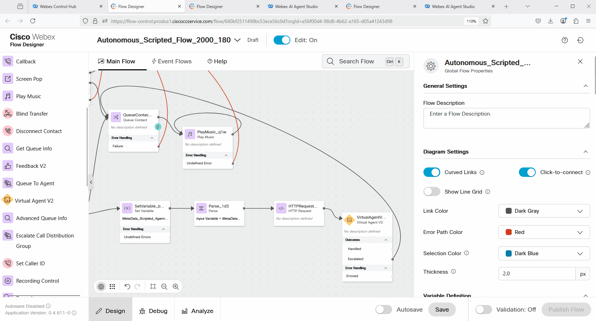
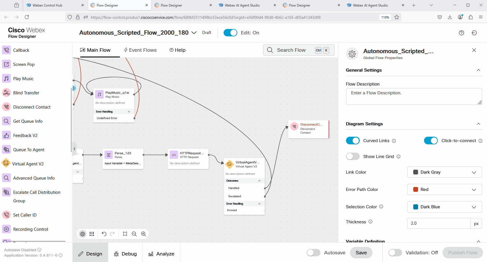
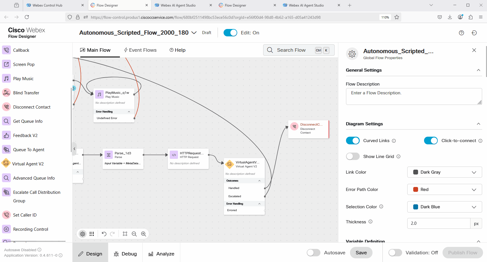
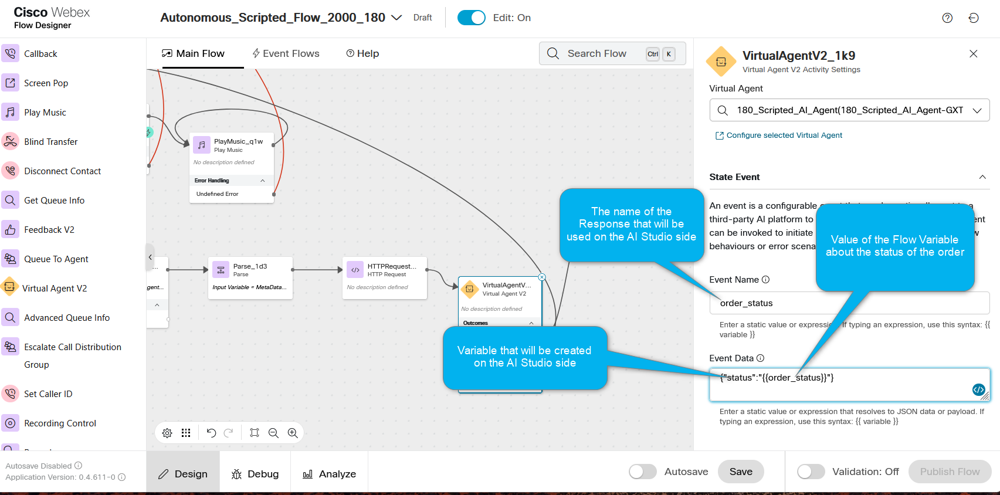
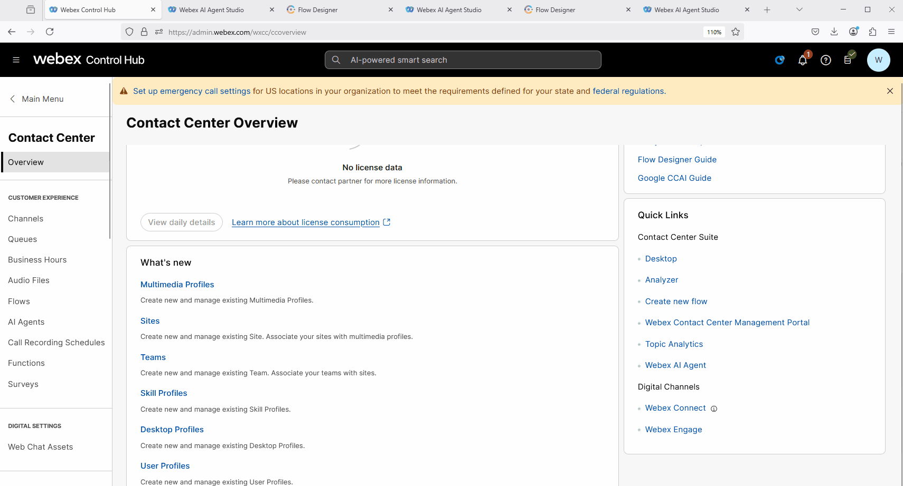
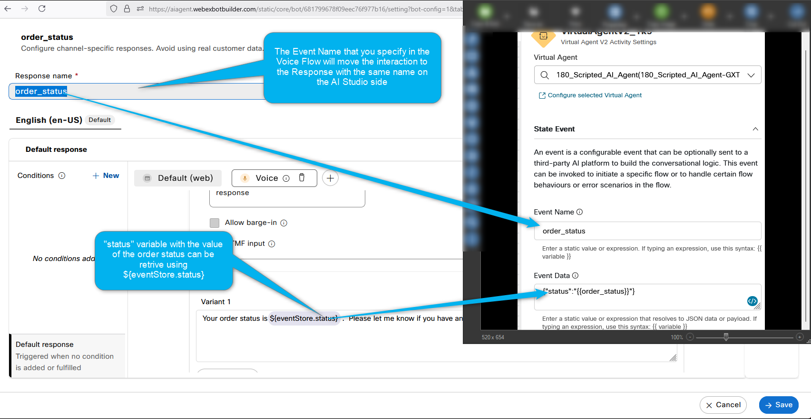
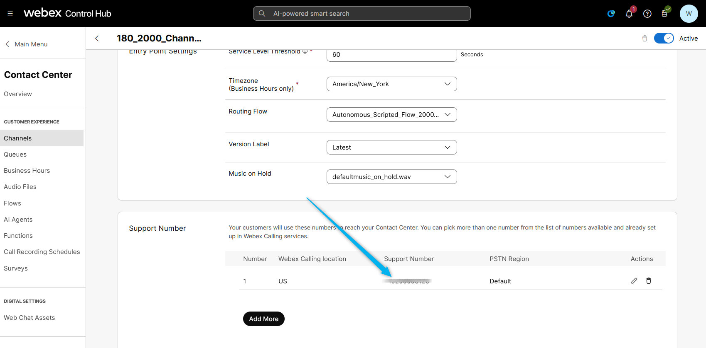

### Mission Details

In the previous **Mission 4**, you configured a fulfillment flow that executes an API call in the WxCC Voice flow based on the order number and parses the order status. In this mission, you will configure the flow to return this status to **AI Studio** so that the Scripted AI agent can deliver the result back to the caller.

### Build

#### Task 1. Add VirtualAgentV2 block to bring data back to AI Studio.

Note: To deliver the call back to AI Studio, you need to add an additional **VirtualAgentV2** block to the flow.

1. Open **Autonomous_Scripted_Flow_2000_Your_Attendee_ID** and click **Create Flow** flow. Click on **Edit** the flow. 
    

2. Delete the **Disconnect Contact** node and add **VirtualAgentV2** node. Connect **HttpRequest** block to **VirtualAgentV2** block. 
    

3. Click on **VirtualAgentV2**. In the Contact Center AI Config search for scripted and select **Webex AI Agent (Scripted)**. Under the Virtual Agent option, search for the Scripted AI Agent with name **Your_Attendee_ID_Scripted_AI_Agent**.
    

4. Connect Escalated output from the **VirtualAgentV2** node to the **Queue** node.
    

5. Add **Disconnect Contact** node and connect **Handled** output to the **Disconnect Contact** node.
    

6. You can publish the flow at this point. 
    

#### Task 2. Configure State Event in the VirtualAgentV2 block

Note: We need to configure the **VirtualAgentV2** block to send the order status to AI Studio, which will be retrieved in the specific response. For this, we will utilize the State Event.

1. Select the **VirtualAgentV2** block that you have added in the previous Task and click on **State Event**. 
    

2. Configure the **State Event** with the following:  
Event Name: **order_status**  
Event Data: **{"status":"{{order_status}}"}**
    

3. Understand the **State Event** configuration. See the picture below. 
    

4. You can publish the flow at this point. 
    

#### Task 3. Review the order_status Response configuration. 

1. Go to AI Studio and open your Scripted Agent. If you followed all the steps the name of the Scripted Agent should be **Your_Attendee_ID_Scripted_AI_Agent** 
    

2. Go to Script > Responses and search for the Response with the name **order_status**. This response is preconfigured in this lab for you. Go to Voice channel and review the configurations. 
    

3. Understand the **order_status** configuration. Please see the picture below. 
    

#### Task 4. Test Scripted AI agent order status flow.  

1. Dial the number that is assosiated with **Your_Attendee_ID_2000_Channel** Channel. 
     

2. During IVR, press 2 to and say "I want to track my order". Provide the order details that you created earlier, or use the order with number 22 for the example.

<strong>Congratulations, you have officially completed this mission! 🎉🎉 </strong>

