#### Task 1. [OVERVIEW ONLY] Review Flower Delivery Topic Collection.

1. Go to <b>Contact centre overview</b>. Under Quick Links , click on **Topic Analytics**.
   

2. On left side click on “Topic Analytics” and click on collection with name **Flower Delivery**.
   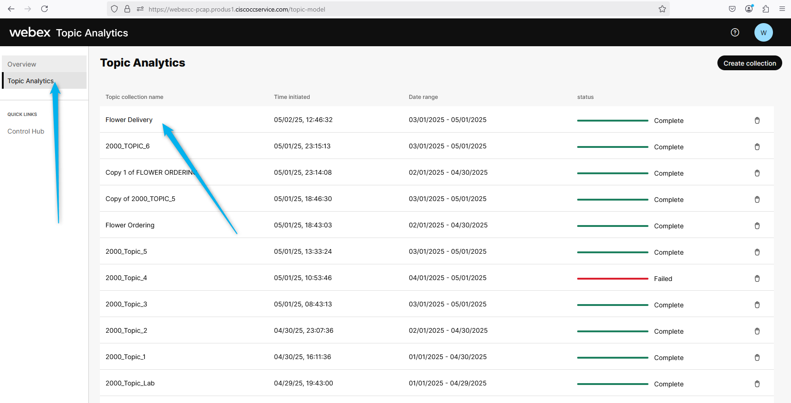

3. Make a note of Total Analyzed interaction and how many of those has recording available.
   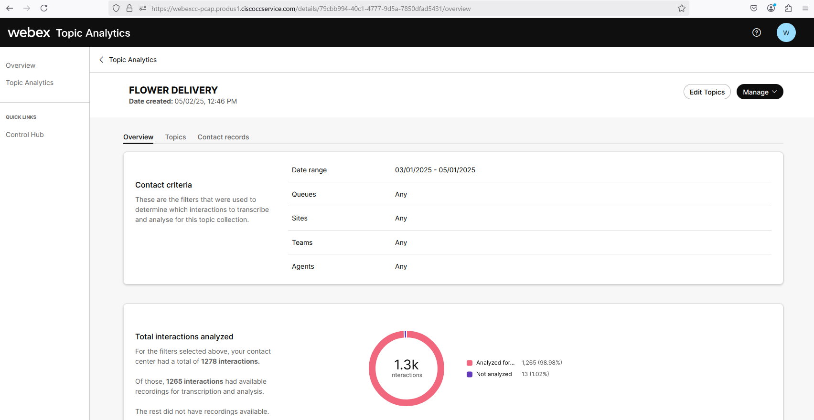

4. Click on **Topic**. There are various **Topics** for which customers are contacting the Contct Center. Knowing this information gives the opportunities for automation and enhanced self-service through virtual agents. For example, one such topic could be **Flower Delivery**. As a business analyst, you might consider implementing an AI agent capable of creating an order and scheduling deliveries.
   

5. There is option for you to download the Topics with details. 
   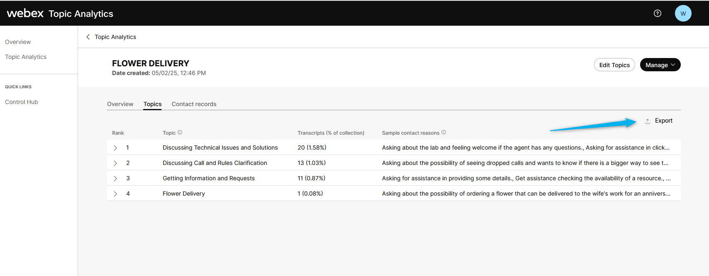

6. Next, click on the **Flower Delivery** topic. This will take you to the **Contact Record** tab, which shows all the contacts associated with this topic, along with the date/time of those calls and the contact reason. If you open any of them, you can view details of the contact, the contact reason, transcripts, and even listen to the call recording.
   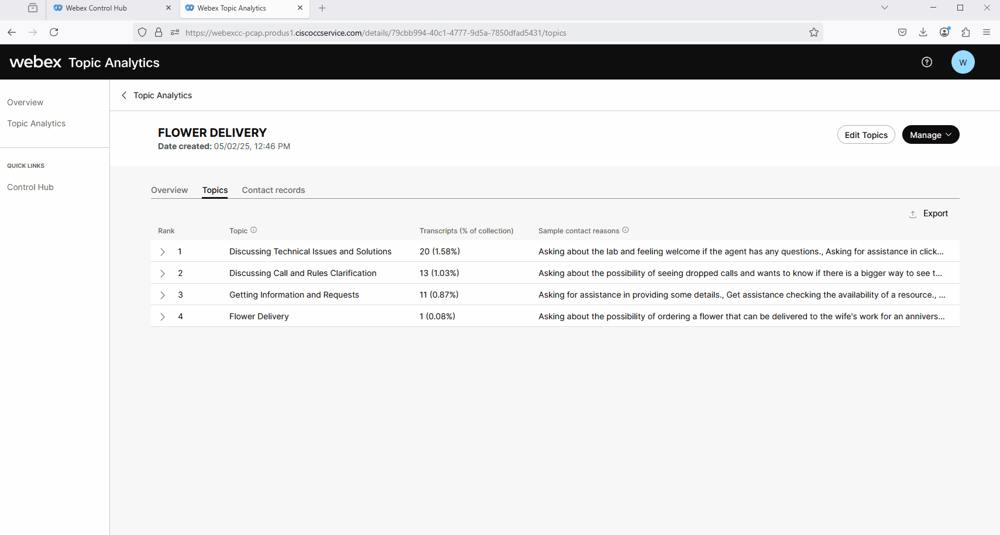

#### Task 2. [OVERVIEW ONLY] Review steps to edit Topic Collection.

7. Topic Analytics enables you to modify your topic collections, allowing you to tailor the topics to better fit specific business needs, language, and terminology. You can rename topics, merge topics, delete topics, add new topics.   
Click on **Edit Topics** on the top-right corner.
   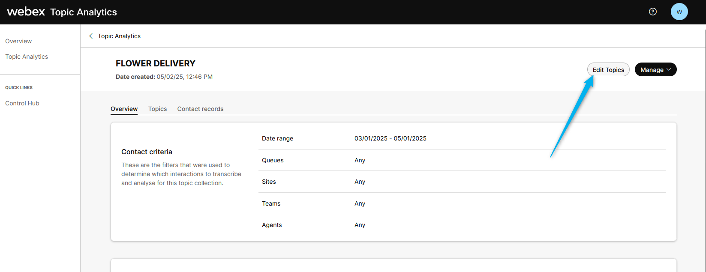

8. In the Name Copy screen, edit the topic collection name. By default, Copy of existing collection name appears in the Topic collection name field.
   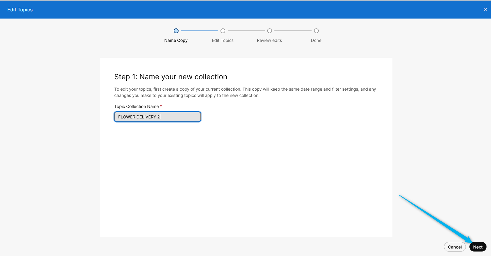

9. Click on Add New
   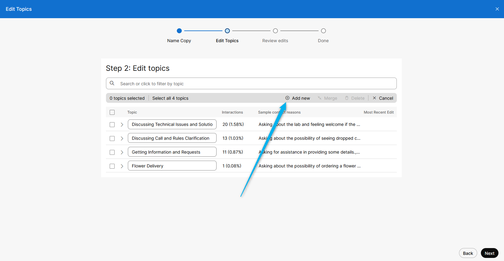

10. Configure the tops with the contact reason examples.
   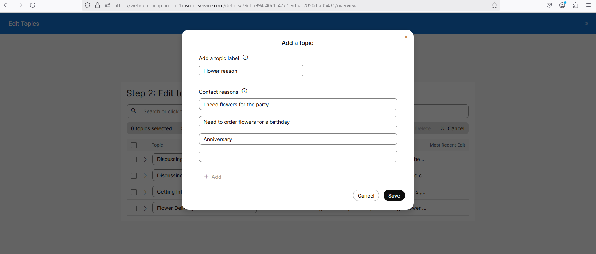

11. Click on **Next**.
   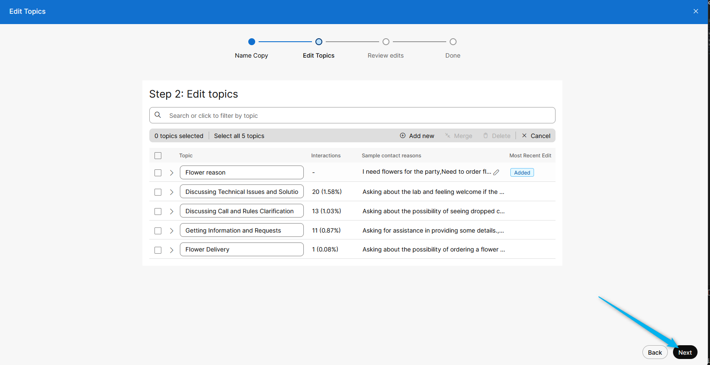

12. Review the **Edits** and click on **Create new topic collection**.
   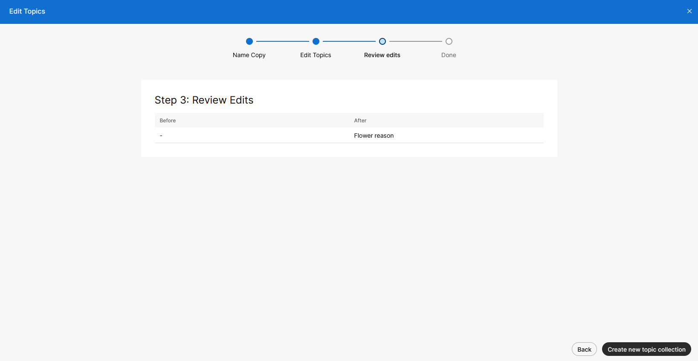

13. Don't delete the orginal Topic while the edited version is creating. Click on **Done**.
   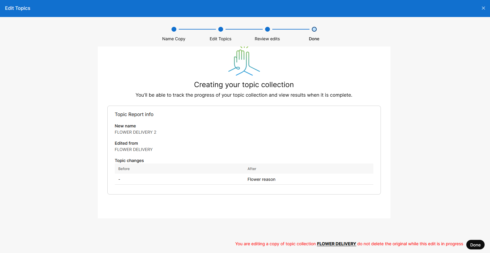

14. You will see that a new Topic collection will be creating, and if you have enough calls with the provided reason, the data will show up in the Topic.
   

15. After the data is generated, you can see the new Topic Collection.
   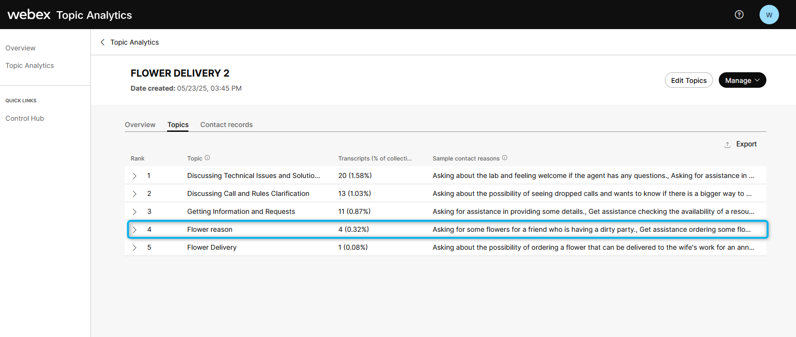

16. You can click on it to review the results. 
   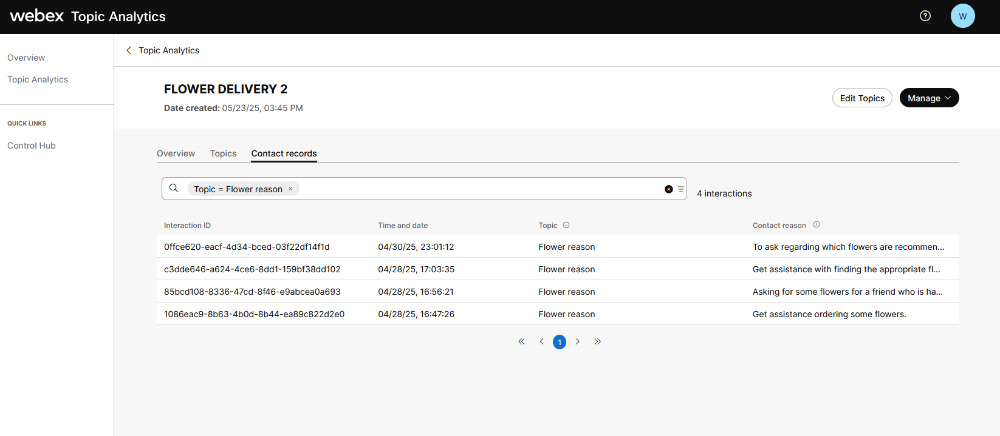

<strong>Congratulations, you have officially completed this mission! 🎉🎉 </strong>

