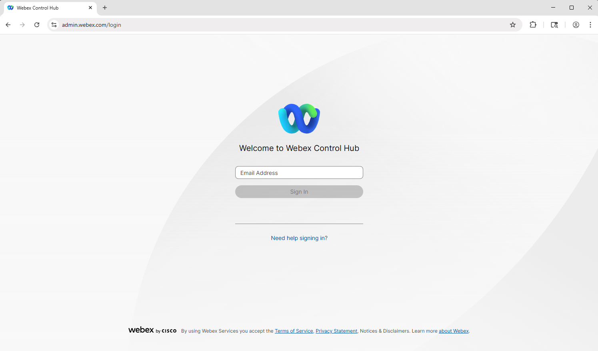
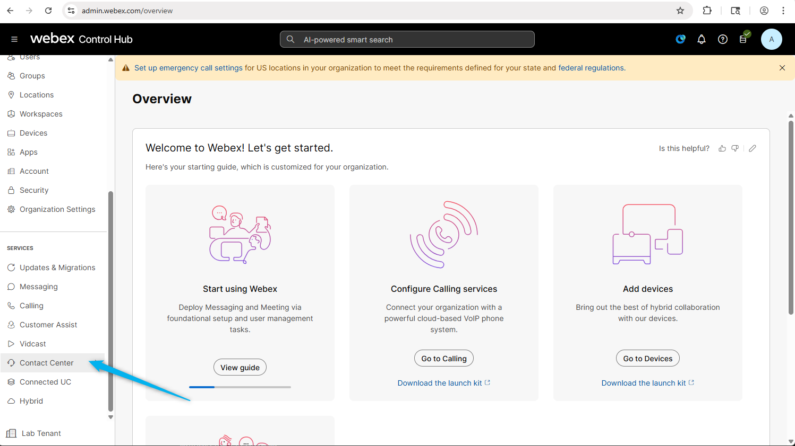
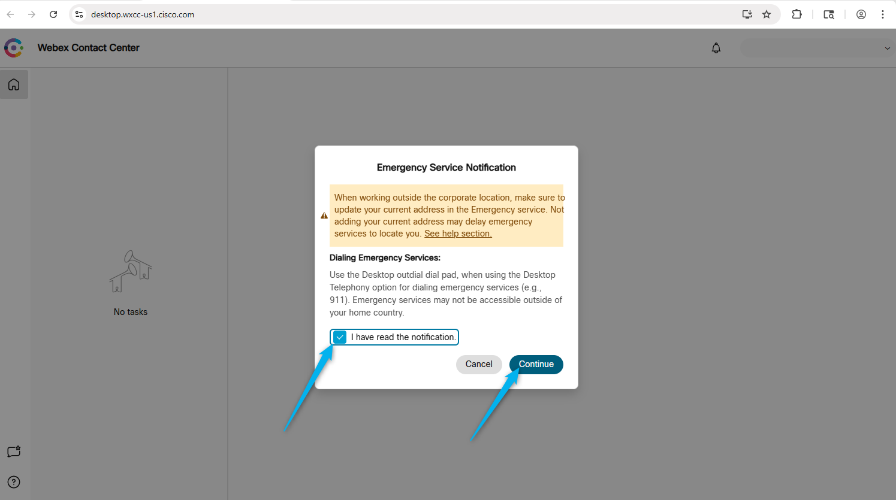

## Learning Objectives
0. [Impotant: [In the Getting Started page](https://webexcc-sa.github.io/AUS_LTRCCT-2000/main/overview/), you must have set your attendee ID. For example: 148. This will make it easy to copy paste the configs]
1. Ensure that you have **LTRCCT-2000 LAB Credentials handed to you - card or digitally** with instructions link to access your lab. If you do not, please ask your lab proctor now.
2. Understand your configuration instructions. Don't rush. Take your time.
3. If you have never used Webex Contact Center, don't worry. You should be able to follow these instructions and finish the lab.

### Know before you start

1. We will be using a shared lab tenant for simulations, meaning all attendees will work within the same Webex Contact Center environment. To avoid conflicts, ensure that any entities you configure are tagged with the Attendee ID assigned to you.
    
    

WxCC Schema

2. The majority of the configuration in Control Hub is already set up, allowing you to focus primarily on configuration Webex AI Virtual Agent and other AI features. Of course, there may still be some elements to adjust, but these should be minimal, letting you concentrate on building and refining the flow logic rather than spending time on initial setup.
3. The Human Agent have been configured for you. You will be performing the rest of the configurations for AI Agent and integartion with channels.
4. All your configurations should contain your attendee ID so the lab users don't step over each other's configurations.
5. Each of you has been provided with the phone number to dial (Entry point DN), 1 agent and 1 admin.
6. Please ask for help when you need it. You can do so by:
      * Raising your hand and calling the proctor.
      * You can also join use this space [LTRCCT-2000 Hands-On AI in Action: The Future of Customer Care with Webex Contact Center](webexteams://im?space=0c8620a0-afba-11f0-87f8-bf6b9c030752)
       
---

### Predefined configuration

> Entry Point/Channels:  **Your_Attendee_ID_2000_Channel**

> Queue:  **Your_Attendee_ID_2000_Voice_Queue**

> Team:  **Your_Attendee_ID_2000_Team**

> Site: SiteOne (Do not try to change this)

> Admin:   **wxcclabs+admin_IDYour_Attendee_ID@gmail.com**

> Webex App has been pre-installed on your Lab PC

> Assigned Inbound Channel Number: **Provided by Lab Instructor**

More pre-configured entities will be mentioned during the lab missions if they have any.

---

### Getting your computers ready

#### Login to Webex Control. 

1. Open up Google Chrome Web browser and start login to [Control Hub](https://admin.webex.com){:target="_blank"}.
   

2. Login using your **Admin** user name and password. 
   

#### Login to Agent Desktop Using Microsoft Edge

1. Click <a href="microsoft-edge:https://desktop.wxcc-us1.cisco.com">Agent Desktop in Edge</a>.
   Or you can copy paste this URL to the Edge browser's address bar: https://desktop.wxcc-us1.cisco.com
   <!---->

2. Allow notification for the Agent Desktop. Select login option as **Desktop**, select your Team and click on **Submit**.
   

3. Click Continue on the Emergency Serice Notification (if applicable).
   

4. Allow use of microphones. This is important because we will be using WebRTC (that is what the Desktop radiobutton choice was about)
   

#### Calling to Contact Center
You can make test calls from your mobile phone or by using Webex Calling app. Please find the Webex App and log in with the admin credentials that were shared with you.
   

Place test call to the test number  +15206603129 to confirm that you Webex Phone is configured to place calls

!!! Note
    International dialing is not allowed so you won't be able to dial your cell phones unless you have a US number.

---

