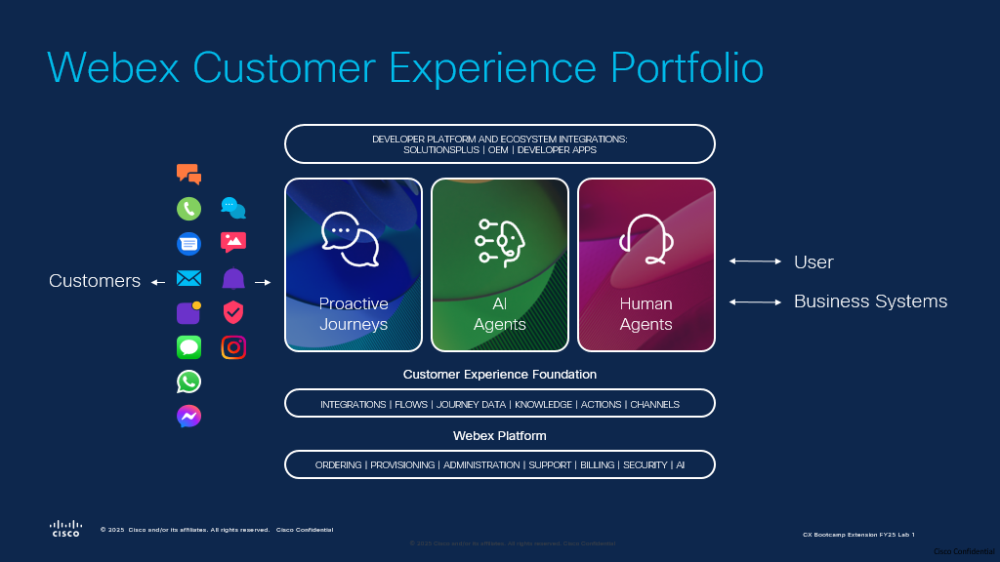

<!-- Markdown content with embedded HTML -->

    <h2>Please submit the form below with your Attendee ID.</h2> 
    <h3>All configuration entries in the lab guide will be renamed to include your Attendee ID.</h3>
    <form id="attendee-form">
        <label for="attendee">Attendee ID:</label>
        <input type="text" id="attendee" name="attendee" placeholder="Enter 3 digits" required>
        <button type="submit">Save</button>
    </form>

     

    
Your stored Attendee ID is: <b>No ID stored</b>

# Overview

## Use Case 

You are designing a Webex AI agent for a flower shop. This AI agent will communicate with customers over voice and digital channels. It will recommend flowers, collect order details, and calculate the total price for standard and custom bouquets. Additionally, it will gather delivery information and email addresses to send order confirmations via SMS. The virtual agent can provide order status updates, store hours or transfer customers to a human agent if needed. The human agent will be equipped with the latest AI technology to ensure exceptional customer support.

You can read more about the Webex AI Agent below and review the video of the use case that we will be imitating in this lab. 

[Webex AI Agent](https://blog.webex.com/customer-experience/announcing-general-availability-of-webex-ai-agent-paving-way-new-era-cx/){:target="_blank"}

## Learning Objectives

Welcome to **"Hands-on AI in Action with Webex Contact Center: Enhancing Self-Service, Agent Assistance & Customer Insights - LTRCCT-2000"** Instructor-led Lab

In this lab, participants will:   
 **• Uncover Trends & Opportunities:** Analyze customer conversation data to identify key themes, trends, and automation opportunities for improved service efficiency.   
 **• Integrate Intelligent AI Agents:** Utilize Cisco Autonomous and Scripted AI Agents to build dynamic, context-aware self-service flows that adapt to customer needs in real-time.   
**• Seamless AI-to-Human Collaboration:** Experience smooth transitions from AI agents to human agents, ensuring continuous context and interaction summaries for effective issue resolution.   
**• Enhance In-Interaction Insights:** Experience AI-driven call summarisation to enhance agent productivity and service quality.   
**• Predict Customer Sentiment:** Learn to leverage AI to forecast customer satisfaction (CSAT) based on interaction data, enabling proactive service adjustments and how to use this for proactive customer engagement.   
**• Utilize Proactive Campaign:** Proactively engage customers through intelligent outreach and dynamic self-service using Webex AI Agents.

    
## Disclaimer
The lab design and configuration examples provided are for educational purposes. For production design queries, please consult your Cisco representative or an authorized Cisco partner.
Let’s get started and discover how **Webex Contact Center Flow Designer** takes customer experiences from good to great!

